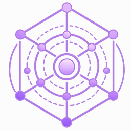

# Gravitas



**Deterministic fixed-point physics for lockstep games and simulations.**

[](https://github.com/mrdav30/Gravitas/actions/workflows/build-and-test.yml)
[](https://mrdav30.github.io/Gravitas/coverage/)
[](https://www.nuget.org/packages/Gravitas)
[](https://mrdav30.github.io/Gravitas/)
[](LICENSE)
[](https://discord.gg/mhwK2QFNBA)

Gravitas gives .NET simulations a physics runtime that can replay the same
inputs into the same results. It combines fixed-point 2D, 3D, and explicit
mixed-dimension physics with context-owned worlds, stable collision ordering,
continuous collision detection, queries, constraints, replay hashes, and
renderer-neutral diagnostics.

## Why Gravitas?

- **Lockstep by design.** Authoritative physics uses deterministic fixed-point
  math and explicit fixed-frame phases.
- **One runtime, three paths.** Run pure 2D, pure 3D, both side by side, or
  deliberate 2D/3D contacts through mixed mode.
- **A complete collision stack.** Build with primitives, convex and concave
  meshes, compounds, materials, manifolds, response islands, CCD, joints, and
  ragdolls.
- **No engine lock-in.** Hosts provide transforms and lifecycle calls through a
  small adapter boundary; Gravitas owns no renderer, scene graph, or ECS.
- **Tools without hidden state.** Context-local queries, replay hashes,
  diagnostic events, and debug-draw commands make simulation behavior visible
  without changing it.

## Install

```bash
dotnet add package Gravitas
```

Prefer the dependency-light serialization profile?

```bash
dotnet add package Gravitas.Lean
```

| Package         | Profile                                                                |
| --------------- | ---------------------------------------------------------------------- |
| `Gravitas`      | Standard package with built-in MemoryPack support                      |
| `Gravitas.Lean` | Same core physics API without the direct MemoryPack runtime dependency |

Both packages target `netstandard2.1` and `net8.0`.

## The Core Loop

Gravitas makes simulation ownership visible. A host owns commands and timing;
one `GravitasWorldContext` owns the physics world and all of its runtime
services.

```csharp
using Gravitas;

using GravitasWorldContext context = GravitasWorldContext.CreateOwned();
context.SetFrameRate(60);

// Configure GridForge coverage, then bind host agents, bodies, and colliders.
// Apply the frame's deterministic commands before advancing physics.
context.Simulate();
context.LateSimulate();

var replayHash = context.ComputeReplayHash();

// Presentation is separate from authoritative simulation state.
context.Visualize();
context.LateVisualize();
```

The full
[Getting Started guide](https://github.com/mrdav30/Gravitas/wiki/GETTING_STARTED)
creates the grid, host adapter, collider, and dynamic body behind that loop.

## What You Can Build

| Area          | Highlights                                                                                                            |
| ------------- | --------------------------------------------------------------------------------------------------------------------- |
| 3D physics    | Dynamic, kinematic, and static bodies; primitive, mesh, and compound colliders; grounding; CCD; constraints; ragdolls |
| 2D physics    | First-class X/Z planar bodies, angular response, compounds, support detection, CCD, constraints, and ragdolls         |
| Mixed physics | Finite 2D slabs embedded in 3D, cross-dimension contacts, constrained response, queries, CCD, and diagnostics         |
| Queries       | Closest-hit, all-hit, overlap, raycast, swept-shape, cone-volume, mixed, and batch APIs                               |
| Determinism   | Stable runtime ownership, replay hashes, explicit serialization boundaries, and caller-owned hot-path buffers         |

## Documentation

- [Getting Started](https://github.com/mrdav30/Gravitas/wiki/GETTING_STARTED) —
  build and step your first world.
- [GitHub Wiki](https://github.com/mrdav30/Gravitas/wiki) — understand host
  integration, dimensions, collisions, queries, replay, and diagnostics.
- [API Reference](https://mrdav30.github.io/Gravitas/api/Gravitas.html) — browse
  public namespaces, types, and members.
- [Coverage Report](https://mrdav30.github.io/Gravitas/coverage/) — inspect the
  current test-suite coverage.
- [Contributing](CONTRIBUTING.md) — build, test, and prepare a focused change.

## Built On The LSF Stack

Gravitas is the physics layer in a modular deterministic simulation stack:

| Library                                                         | Responsibility                                            |
| --------------------------------------------------------------- | --------------------------------------------------------- |
| [FixedMathSharp](https://github.com/mrdav30/FixedMathSharp)     | Fixed-point scalars, transforms, and full-domain geometry |
| [SwiftCollections](https://github.com/mrdav30/SwiftCollections) | Low-allocation collections, pools, and spatial structures |
| [GridForge](https://github.com/mrdav30/GridForge)               | Explicit voxel worlds, traversal, and partition backing   |
| [Chronicler](https://github.com/mrdav30/Chronicler)             | Deterministic state transfer and replay infrastructure    |

## Contributing

Contributions are welcome. Start with [CONTRIBUTING.md](CONTRIBUTING.md); the
deeper deterministic, physics, testing, and performance rules live in
[AGENTS.md](AGENTS.md).

For questions and discussion,
[join the community on Discord](https://discord.gg/mhwK2QFNBA).

## License

Gravitas is available under the [MIT License](LICENSE). See [NOTICE](NOTICE) and
[COPYRIGHT](COPYRIGHT) for attribution details.
