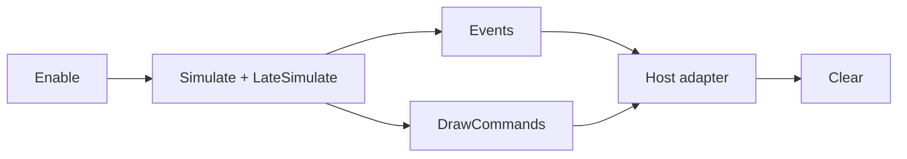

# Diagnostics

Gravitas diagnostics are context-owned, deterministic, and engine-agnostic. They
expose physics state for debug drawing, logs, replay tooling, and server-side
inspection without linking the core library to an engine, editor, or renderer.

Diagnostics are disabled by default. Disabled runtime hooks return before
touching diagnostic buffers. Enabled events and draw commands append to
pre-sized `SwiftList` buffers owned by the active `GravitasWorldContext`.

For host-side translation patterns, read
[Diagnostic Adapters](DIAGNOSTIC_ADAPTERS.md).

## Quick Read

- Use `context.Diagnostics`.
- Call `Enable(...)` with realistic capacities before capture-heavy runs.
- Consume `Events` and `DrawCommands` after the deterministic frame or capture
  window.
- Call `Clear()` after consuming a per-frame stream.
- Prefer visitors and typed views over manual generic-field decoding.
- Keep adapters outside `src/Gravitas`.
- Leave diagnostics disabled for normal hot-path measurements unless the
  measurement is specifically about diagnostics.



## Entry Point

```csharp
context.Diagnostics.Enable(eventCapacity: 512, drawCommandCapacity: 256);
context.Simulate();
context.LateSimulate();

foreach (GravitasDiagnosticEvent diagnosticEvent in context.Diagnostics.Events)
{
    // Translate to logs, overlays, replay markers, or host telemetry.
}

foreach (GravitasDebugDrawCommand command in context.Diagnostics.DrawCommands)
{
    // Translate to host-specific lines, meshes, gizmos, or debug shapes.
}

context.Diagnostics.Clear();
```

`Enable(...)` reserves capacity to avoid resize spikes when expected event
counts are known. `Clear()` resets captured data and per-frame sequence values
while keeping allocated buffers. `Disable()` clears and stops capture.

## Event Stream

`GravitasDiagnosticEvent` is a compact generic payload. The common fields are:

| Field                                      | Meaning                                                                            |
| ------------------------------------------ | ---------------------------------------------------------------------------------- |
| `Frame`                                    | Owning context frame count when captured.                                          |
| `Sequence`                                 | Capture order inside the current buffer.                                           |
| `Kind`                                     | Event payload type.                                                                |
| `BodyId`, `JointId`                        | Context-local IDs, or `-1` when not applicable.                                    |
| `ColliderAId`, `ColliderBId`               | Context-local collider IDs, or `-1` when not applicable.                           |
| `ColliderADimension`, `ColliderBDimension` | Collider runtime surface: `ThreeD`, `TwoD`, or `None`.                             |
| `ColliderAType`, `ColliderBType`           | 3D collider shape types when present.                                              |
| `ColliderA2DType`, `ColliderB2DType`       | 2D collider shape types when present.                                              |
| `Start`, `End`                             | Query segment, previous/current velocity, or other vector pair.                    |
| `PointA`, `PointB`                         | Contact points, hit point, acceleration delta, or shape-specific point data.       |
| `Vector`                                   | Force, torque, velocity delta, query normal, contact normal, or impulse direction. |
| `ScalarA`, `ScalarB`                       | Event-specific fixed-point values.                                                 |
| `DataA`, `DataB`                           | Event-specific integer values.                                                     |
| `Hit`                                      | Whether the event represents a successful hit/contact.                             |

The stream is scoped to one context. Collider, body, and joint IDs are not
global and must be resolved through the same context that produced the event.

## Event Families

| Family                | Event kinds                                                                                 | Typical use                                                                             |
| --------------------- | ------------------------------------------------------------------------------------------- | --------------------------------------------------------------------------------------- |
| Body deltas           | `ForceDelta`, `TorqueDelta`, `LinearVelocityDelta`, `AngularVelocityDelta`                  | Inspect force/torque application and response velocity changes.                         |
| Queries               | `GroundProbe`, `RayQuery`, `CircleQuery`, `MixedQuery`, `QuerySummary`                      | Inspect hit counts, layer masks, probe shape, reducer quality, and mixed query results. |
| Contacts and response | `Contact`, `ResponseImpulse`, `MixedContact`, `MixedResponseImpulse`, `MixedResponseIsland` | Inspect manifolds, impulse magnitude, island iteration behavior, and mixed response.    |
| Constraints           | `JointRegistered`, `JointRemoved`, `JointImpulse`, `JointLimitReached`                      | Inspect joint ownership, solve metrics, limits, motors, and collision policy.           |
| Ragdolls              | `RagdollActivated`                                                                          | Inspect activation state, link count, and joint count.                                  |

`QuerySummary` reports eligible top-level exact reducer attempts, accepted hits,
fallback hits, and rejected conservative candidates. Mixed query diagnostics use
it to show exact-versus-conservative query quality beside ordinary `MixedQuery`
hit events.

## Typed Views And Dispatch

Host adapters should usually consume events through
`GravitasDiagnosticEventVisitor`:

```csharp
public sealed class MyDiagnosticAdapter : GravitasDiagnosticEventVisitor
{
    public override void VisitMixedContact(in GravitasMixedContactDiagnosticView contact)
    {
        // contact.Collider3DId, contact.Collider2DId,
        // contact.Point3D, contact.Point2D, contact.Normal3DTo2D, contact.Depth
    }
}

context.Diagnostics.DispatchEventsTo(adapter);
```

Available views cover the event stream:

- `GravitasForceDeltaDiagnosticView`
- `GravitasTorqueDeltaDiagnosticView`
- `GravitasVelocityDeltaDiagnosticView`
- `GravitasGroundProbeDiagnosticView`
- `GravitasRayQueryDiagnosticView`
- `GravitasCircleQueryDiagnosticView`
- `GravitasQuerySummaryDiagnosticView`
- `GravitasContactDiagnosticView`
- `GravitasResponseImpulseDiagnosticView`
- `GravitasMixedQueryDiagnosticView`
- `GravitasMixedContactDiagnosticView`
- `GravitasMixedResponseImpulseDiagnosticView`
- `GravitasMixedResponseIslandDiagnosticView`
- `GravitasJointDiagnosticView`
- `GravitasRagdollDiagnosticView`

`GravitasGroundProbeDiagnosticView` exposes both 3D and 2D probe metadata. Use
`Mode` for 3D `GroundProbeMode`, `Mode2D` for 2D `GroundProbeMode2D`, and
dimension/type properties to route shape payloads. 2D probe points are stored in
the X/Z debug plane: event X is planar X, event Z is planar Y, and event Y is
zero.

The views are read-only wrappers over the event value. Visitors and views do not
change capture storage, event ordering, diagnostic buffering, or disabled path
cost. Lower-level `TryAs...` helpers remain available for one-off filters over
known event kinds.

## Solver And Query Counters

Some diagnostics are service-local counters instead of event-buffer entries:

| Counter family        | Surface                                                                                                                                                                                  |
| --------------------- | ---------------------------------------------------------------------------------------------------------------------------------------------------------------------------------------- |
| CCD island handoff    | `GravitasPhysicsService` and `GravitasPhysics2DService` `LastContinuousCollisionIslandCount`, `LastContinuousCollisionIslandIterationCount`, `LastContinuousCollisionIslandLimitReached` |
| Body TOI work         | `SolidBody.LastContinuousCollisionToiIterationCount`, `LastContinuousCollisionToiIterationLimitReached`, and matching `SolidBody2D` values                                               |
| Batch queries         | `Query2D`, `Query3D`, and `QueryMixed` `LastBatchRequestCount`, `LastBatchHitCount`, `LastBatchCandidateCount`                                                                           |
| Mixed batch mesh work | `QueryMixed.LastBatchMeshTriangleCandidateCount`                                                                                                                                         |

These counters are deterministic frame-local state for tuning, tests, host
telemetry, and benchmark triage. They are not serialized replay state.

Each active `Joint3D` and `Joint2D` also exposes `LastSolveMetrics`, a
deterministic snapshot from the most recent solver pass. It reports row count,
anchor error, limit error, motor error, cached impulse, fresh impulse, motor
impulse, and clamped row count. These values mirror `JointImpulse` diagnostic
views and are measurement state, not extra tuning knobs.

## Draw Commands

`GravitasDebugDrawCommand` is the renderer-facing stream. Gravitas emits
primitive draw descriptions; hosts translate them into their own debug drawing
API.

| Kind           | Required payload                                  |
| -------------- | ------------------------------------------------- |
| `Line`         | `Start`, `End`, `Color`                           |
| `Ray`          | `Start`, `End`, `Color`                           |
| `Point`        | `Center`, `Radius`, `Color`                       |
| `WireSphere`   | `Center`, `Radius`, `Color`                       |
| `WireBox`      | `Center`, `Size`, `Rotation`, `Color`             |
| `WireCapsule`  | `Center`, `Radius`, `Height`, `Rotation`, `Color` |
| `WireCylinder` | `Center`, `Radius`, `Height`, `Rotation`, `Color` |
| `WireCone`     | `Center`, `Radius`, `Height`, `Rotation`, `Color` |
| `WireTriangle` | `PointA`, `PointB`, `PointC`, `Color`             |

Host renderers can consume draw commands through
`GravitasDebugDrawCommandVisitor` and
`context.Diagnostics.DispatchDrawCommandsTo(...)`.

Use explicit capture helpers for host-driven overlays:

```csharp
context.Diagnostics.CaptureCollider(collider, GravitasDiagnosticColor.Cyan);
context.Diagnostics.CaptureMixedCollider(collider2D, GravitasDiagnosticColor.Cyan);
context.Diagnostics.CaptureJoint(joint, GravitasDiagnosticColor.Yellow);
context.Diagnostics.CaptureLine(start, end, GravitasDiagnosticColor.Yellow);
context.Diagnostics.CaptureRay(origin, direction, maxDistance, GravitasDiagnosticColor.Green);
context.Diagnostics.CapturePoint(point, Fixed64.Half, GravitasDiagnosticColor.Red);
```

`CaptureCollider(...)` emits one command for primitive colliders and one
`WireTriangle` command per mesh triangle. Compound colliders emit one command
per internal part using the owning compound collider ID and `ColliderType`
`Compound`.

`CaptureMixedCollider(LSCollider2D, ...)` emits the finite 2D slab/prism used by
mixed collision. Circles draw as vertical wire cylinders, AABBs as wire boxes,
and polygons as top, bottom, and vertical slab edges. Commands are tagged with
`GravitasColliderDimension.TwoD`.

`CaptureJoint(Joint3D, ...)` emits anchors, anchor-error line, and active
angular axes for hinge, cone-twist, and fixed joints.
`CaptureJoint(Joint2D, ...)` emits planar anchors, anchor-error line, and
prismatic slider axis where applicable.

## Performance Rules

- Leave diagnostics disabled in normal hot-path measurements unless the
  measurement is about diagnostics.
- Reserve realistic capacities with `Enable(...)` before capture-heavy runs.
- Call `Clear()` once the host consumes a frame or diagnostic window.
- Do not project diagnostics through `SwiftCollections.Observable` in
  authoritative simulation paths without tests and benchmarks for ordering and
  notification cost.
- Add benchmarks when new event hooks or draw commands touch collision,
  partitioning, queries, body integration, or response paths.

## Boundaries

- Diagnostics are same-thread context buffers.
- Event storage is intentionally generic. Add a documented event kind or typed
  view when a subsystem needs richer diagnostics.
- Draw commands are wire/debug descriptions, not mesh generation utilities.
- Hosts remain responsible for rendering, logging, persistence, and replay UI.

## Source Map

| Area                          | Source                                                                                                                                                                                                                                       |
| ----------------------------- | -------------------------------------------------------------------------------------------------------------------------------------------------------------------------------------------------------------------------------------------- |
| Diagnostic sink               | [`src/Gravitas/Diagnostics/GravitasDiagnosticSink.cs`](../../src/Gravitas/Diagnostics/GravitasDiagnosticSink.cs), [`src/Gravitas/Diagnostics/GravitasDiagnosticSink.Draw.cs`](../../src/Gravitas/Diagnostics/GravitasDiagnosticSink.Draw.cs) |
| Event payloads and views      | [`src/Gravitas/Diagnostics/Events`](../../src/Gravitas/Diagnostics/Events)                                                                                                                                                                   |
| Debug draw payloads and views | [`src/Gravitas/Diagnostics/DebugDraw`](../../src/Gravitas/Diagnostics/DebugDraw)                                                                                                                                                             |
| Diagnostics tests             | [`tests/Gravitas.Tests/Diagnostics`](../../tests/Gravitas.Tests/Diagnostics)                                                                                                                                                                 |
| Diagnostics benchmarks        | [`tests/Gravitas.Benchmarks/Diagnostics`](../../tests/Gravitas.Benchmarks/Diagnostics)                                                                                                                                                       |
