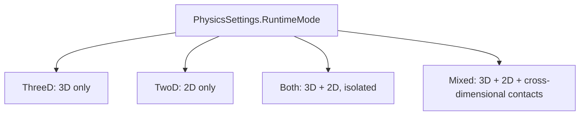

# 2D, 3D, And Runtime Modes

Gravitas has first-class 3D, first-class 2D, and explicit mixed 2D/3D
interaction. The runtime is type-driven: `SolidBody` and `LSCollider` are the 3D
path, while `SolidBody2D` and `LSCollider2D` are the 2D path.

There is no public `PhysicsDimension` enum that changes a body's behavior after
creation. Concrete body and collider types define the simulation domain. Mixed
behavior is an explicit policy between those concrete types.

## Quick Read

- Use `PhysicsRuntimeMode.ThreeD` for normal 3D physics.
- 3D bodies use `Vector3d` position, `FixedQuaternion` rotation, and full
  translation/rotation solver controls.
- Use `PhysicsRuntimeMode.TwoD` for 2D physics in the X/Z plane.
- Use `PhysicsRuntimeMode.Both` when 2D and 3D should run side by side without
  cross-dimensional contacts.
- Use `PhysicsRuntimeMode.Mixed` when 2D and 3D colliders should collide.
- 2D position is `Vector2d`; `Vector2d.x` maps to world X and `Vector2d.y` maps
  to world Z.
- World Y is not a 2D collision axis. In mixed mode it centers the finite 2D
  slab used by cross-dimensional collision.
- 2D constraints are native planar/scalar physics, not projected 3D joints.



## Runtime Mode

`PhysicsSettings.RuntimeMode` selects which dimensional services a
`GravitasWorldContext` advances:

| Mode     | Services advanced                                  | Cross-dimensional contacts |
| -------- | -------------------------------------------------- | -------------------------- |
| `ThreeD` | 3D physics, 3D collision, 3D queries/visualization | No                         |
| `TwoD`   | 2D physics, 2D collision, 2D queries/visualization | No                         |
| `Both`   | 2D and 3D services side by side                    | No                         |
| `Mixed`  | 2D, 3D, plus mixed collision/query/CCD lifecycle   | Yes                        |

The context clock, coroutines, diagnostics, replay hash service, and lifecycle
hooks remain shared. Runtime modes are validated exactly; `None` and arbitrary
bit combinations are rejected as settings values.

## Public Surface

| Domain      | Bodies                    | Colliders                           | Constraints                      | Queries              |
| ----------- | ------------------------- | ----------------------------------- | -------------------------------- | -------------------- |
| 3D          | `SolidBody`               | built-in `LSCollider` implementations   | `Joint3D`, `RagdollRuntime3D` | `context.Query3D` |
| 2D          | `SolidBody2D`             | built-in `LSCollider2D` implementations | `Joint2D`, `RagdollRuntime2D` | `context.Query2D` |
| Mixed 2D/3D | Existing 3D and 2D bodies | 3D colliders plus embedded 2D slabs | Mixed contacts, not mixed joints | `context.QueryMixed` |

Supported 3D collider types:

| Collider             | Shape family                                          |
| -------------------- | ----------------------------------------------------- |
| `LSSphereCollider`   | Sphere                                                |
| `LSCapsuleCollider`  | Capsule                                               |
| `LSCuboidCollider`   | Cuboid                                                |
| `LSCylinderCollider` | Finite cylinder                                       |
| `LSConeCollider`     | Finite cone                                           |
| `LSMeshCollider`     | Mesh target and convex mesh sweep source              |
| `LSCompoundCollider` | Stable authored 3D parts under one public collider ID |

Supported 2D collider types:

| Collider               | Shape family                                          |
| ---------------------- | ----------------------------------------------------- |
| `LSCircleCollider2D`   | Circle                                                |
| `LSCapsuleCollider2D`  | Capsule                                               |
| `LSAABBoxCollider2D`   | Axis-aligned box                                      |
| `LSPolygonCollider2D`  | Convex polygon and triangle helper output             |
| `LSCompoundCollider2D` | Stable authored 2D parts under one public collider ID |

Supported mixed narrow phase covers 3D sphere, cuboid, capsule, finite cylinder,
finite cone, compound, and mesh colliders against embedded 2D circle, capsule,
AABB, convex polygon, and compound slabs.

## 3D Bodies And Colliders

`SolidBody` is constructed from an `IMatterAgent` and an `LSCollider`. The agent
supplies the context and host transform bridge. Dynamic 3D bodies publish
authoritative `Vector3d` position and `FixedQuaternion` rotation back to the
host `FixedTransform` during `Visualize()` whenever the runtime mode runs the 3D
service (`ThreeD`, `Both`, or `Mixed`). Kinematic 3D bodies read the agent
transform during `LateSimulate()`.

3D body mobility is explicit:

| Concern                     | API                                          |
| --------------------------- | -------------------------------------------- |
| Runtime role                | `MotionType`, `SetMotionType(...)`           |
| Freeze translation/rotation | `SolidBody.FreezeAxes`, `BodyFreezeAxes3D`   |
| Solver linear mobility      | `CanTranslate`, `EffectiveInverseMass`       |
| Solver angular mobility     | `CanRotate`, `EffectiveInverseInertiaTensor` |
| Body-local COM              | `LocalCenterOfMassOffset`                    |
| World COM                   | `WorldCenterOfMass`                          |
| Immediate linear impulse    | `AddLinearImpulse(...)`                      |
| Queued linear force         | `AddForce(...)`                              |
| Immediate angular impulse   | `AddAngularImpulse(...)`                     |
| Queued angular torque       | `AddTorque(...)`                             |

Linear impulse uses mass-distance-per-time units and changes velocity
immediately by `impulse * EffectiveInverseMass`. Angular impulse uses
mass-distance-squared-per-time units and changes angular velocity immediately
through `EffectiveInverseInertiaTensor`. Neither impulse API applies
`DeltaTime` or advances pose. `AddForce(...)` and `AddTorque(...)` instead queue
continuous inputs whose acceleration is integrated during the next fixed step.

3D contact response uses full 3D COM-relative contact arms, `Fixed3x3` inverse
inertia tensors, collider surface materials, normal impulses, tangent friction,
deterministic warm-start caches, grounding state, and sleep/wake rules. Shape
mutation wakes sleeping bound bodies before broad-phase refresh, matching the 2D
mutation contract.

## 2D Coordinate Contract

2D uses the X/Z planar convention:

| 2D value                 | World/host value                                                           |
| ------------------------ | -------------------------------------------------------------------------- |
| `Vector2d.x`             | `Vector3d.x`                                                               |
| `Vector2d.y`             | `Vector3d.z`                                                               |
| Positive scalar rotation | Rotates planar right toward planar forward; embeds as negative world-Y yaw |
| World `Vector3d.y`       | Height or mixed embedding metadata                                         |

Use `FixedTransform.WorldPositionXZ` and `WorldRotationXZRadians` at the host
boundary. Their local counterparts are for authored local components, not
hierarchy-aware physics state. `Vector3d.ToVector2d()` remains the direct X/Z
vector conversion.

2D body motion has no `HeightPos`, 3D step offset, or y-up platform state.
Grounding is modeled as planar support in the 2D simulation plane:
`SolidBody2D.IsGrounded`, `WasGrounded`, `GroundNormal`, `GroundPoint`, and
`LastGroundedPosition` are X/Z-plane values.

Dynamic 2D bodies publish their authoritative planar position and yaw rotation
back to the host `FixedTransform` during `Visualize()` whenever the runtime mode
runs the 2D service (`TwoD`, `Both`, or `Mixed`). The host transform's
world-space Y value is preserved because it is not part of 2D physics. Gravitas
stores authoritative scalar yaw in the canonical half-open range `[-Pi, Pi)`;
`+Pi` and equivalent multi-turn inputs therefore use the single `-Pi`
representative.

## 2D Bodies And Colliders

`SolidBody2D` is constructed from an `IMatterAgent` and an `LSCollider2D`,
matching the host-facing shape of the 3D body API. The agent supplies the
context and host transform bridge. Kinematic 2D bodies read the agent transform
during `LateSimulate()` and project its X/Z position into authoritative
`Vector2d` state.

2D body mobility is explicit:

| Concern                       | API                                            |
| ----------------------------- | ---------------------------------------------- |
| Runtime role                  | `MotionType`, `SetMotionType(...)`             |
| Freeze planar translation/yaw | `SolidBody2D.FreezeAxes`                       |
| Solver linear mobility        | `CanTranslate`, `EffectiveInverseMass`         |
| Solver yaw mobility           | `CanRotate`, `EffectiveInverseMomentOfInertia` |
| Body-local COM                | `LocalCenterOfMassOffset`                      |
| World COM                     | `WorldCenterOfMass`                            |
| Immediate planar impulse      | `AddLinearImpulse(...)`                        |
| Queued planar force           | `AddForce(...)`                                |
| Immediate yaw impulse         | `AddAngularImpulse(...)`                       |
| Queued yaw torque             | `AddTorque(...)`                               |

Pure 2D impulse and continuous-force units match the 3D contract. Planar and
yaw impulses change velocity immediately without applying `DeltaTime` or
advancing pose; planar force and yaw torque are integrated during the next
fixed step.

`BodyFreezeAxes2D.PositionX` maps to world X. `BodyFreezeAxes2D.PositionY` maps
to world Z, not world height. `BodyMotionType` selects solver-controlled
`Dynamic`, host-controlled `Kinematic`, or immobile `Static` ownership in both
dimensions. Freeze masks then constrain dynamic degrees of freedom without
changing that role. A fully position-frozen dynamic body has zero effective
linear mass but may retain angular response; a yaw-frozen body may retain
linear response. Static, kinematic, inactive, and non-positive-mass states
contribute zero applicable solver mobility.

2D contact response uses planar COM-relative contact arms, scalar inverse
moment, collider surface materials, normal impulses, tangent Coulomb friction,
and deterministic warm-start caches. Convex/convex face contacts can resolve
through a fixed two-contact `ContactManifold2D`; circle/circle and circle/convex
contacts remain one-contact manifolds.

`LSCollider2D.InitializeWithNoBody(IMatterAgent)` binds bodyless static geometry
and bodyless trigger volumes to the same host contract. Bodyless 2D colliders
participate in queries, triggers, layer filtering, cleanup, and static collision
response.

`LSPolygonCollider2D` validates convexity and rejects concave or collinear input
instead of silently accepting ambiguous collision truth. A rotated box should
use a convex polygon; `LSAABBoxCollider2D` remains axis-aligned by design.
Triangle authoring helpers materialize as three-vertex convex polygons.

## Shape Definitions And Mass Properties

Shape definitions are data-only authoring/import surfaces. Runtime collider
shells own context binding, collider IDs, partition state, pair state, events,
and query stamps.

| Domain | Definition types                                      | Runtime materialization                                            | Mass properties                                                                      |
| ------ | ----------------------------------------------------- | ------------------------------------------------------------------ | ------------------------------------------------------------------------------------ |
| 3D     | `ColliderShapeDefinition`, `CompoundColliderPart`     | built-in `LSCollider` implementations and private `LSCompoundCollider` parts     | local center of mass, shape-derived mass distribution, and `Fixed3x3` inertia tensor |
| 2D     | `ColliderShapeDefinition2D`, `CompoundColliderPart2D` | built-in `LSCollider2D` implementations and private `LSCompoundCollider2D` parts | local center of mass, area, and scalar moment of inertia                             |

3D compound assets should serialize `CompoundColliderPart` values, not private
runtime part colliders. `LSCompoundCollider` aggregates private parts in stable
part order and uses each part's local offset, local rotation, local scale,
material, center of mass, and inertia contribution under one public 3D collider
identity.

2D compound assets should serialize `CompoundColliderPart2D` values, not private
runtime part colliders. `LSCompoundCollider2D` aggregates private parts in
stable part order, assigns area-proportional part mass, applies owner local
offset, and honors authored part scale/rotation before computing center of mass
and scalar moment.

`FixedTransform.LocalScale` is general authored transform data and may be signed
or zero. Gravitas collider dimensions are a stricter boundary: runtime colliders
require every consumed authored local axis throughout the transform ancestry and
the strictly composed world TRS scale axis to be greater than zero before body
registration, shape, mass, bounds, or partition state is mutated. Pure 2D
consumes X/Z and rejects a composed basis that leaves its simulation plane; 3D
consumes X/Y/Z. Multiple negative scales do not become valid merely because
their signs cancel, and rotated nonuniform hierarchy scale that produces real
shear is rejected instead of being approximated as diagonal scale. Invalid
physics scale is rejected atomically without rewriting the host's authored
local transform.

Compound owner and part scales are retained as separate factors until the final
canonical dimension or centered coordinate is formed. Exact fused admission
therefore accepts a representable final value even when an ordinary chained
multiply would have saturated, while still rejecting an unrepresentable or
nonpositive physical result.

## Broad Phase

3D and 2D broad phase are both GridForge-backed. Colliders own their
dimension-specific bounds and runtime services map those bounds into partition
payloads attached to GridForge voxels.

| Domain | Bounds                                                           | Partition payload       | Coordinate rule                                         |
| ------ | ---------------------------------------------------------------- | ----------------------- | ------------------------------------------------------- |
| 3D     | `FixedBoundBox`                                                  | `PhysicsPartition`      | Full X/Y/Z voxel coverage                               |
| 2D     | `FixedBoundArea`                                                 | `PhysicsPartition2D`    | X/Z coverage stored on the internal Y=0 GridForge plane |
| Mixed  | `FixedBoundBox` derived from 2D X/Z bounds plus slab Y/thickness | `PhysicsMixedPartition` | Full 3D candidate coverage for cross-dimensional pairs  |

Partitions store collider IDs, split static/kinematic/dynamic membership, keep
awake dynamic sets where the solver needs them, and distribute candidates in
sorted deterministic order.

2D partition storage on Y=0 is a stable voxel identity for broad-phase lookup;
it is not public 3D thickness and does not imply mixed collision. The 2D runtime
does not expose a public bounds/config bridge; bounds ownership stays on
`LSCollider2D` and runtime services.

## Constraints

3D and 2D constraints are native to their domains:

| Domain | Service                 | Joint types                                          | Runtime notes                                                                                                                                                                            |
| ------ | ----------------------- | ---------------------------------------------------- | ---------------------------------------------------------------------------------------------------------------------------------------------------------------------------------------- |
| 3D     | `context.Constraints3D` | ball-socket, hinge, cone-twist, fixed                | `Joint3D` uses two local `FixedTransform` frames, optional angular limits, optional `FixedQuaternion` motor targets, linked-collider suppression, replay hashing, and joint diagnostics. |
| 2D     | `context.Constraints2D` | distance, pin/revolute, weld/fixed, prismatic/slider | `Joint2D` uses planar anchors, scalar yaw limits, scalar/linear motors, linked-collider suppression, replay hashing, and joint diagnostics.                                              |

3D joints solve inside 3D response islands during `LateSimulate()` and respect
`SolidBody.CanTranslate`, `CanRotate`, `EffectiveInverseMass`, and
`EffectiveInverseInertiaTensor`.

2D limits and motors use `Fixed64` scalar values. Distance limits are world
units, slider limits are signed translation along the joint axis, angular limits
are radians, angular motors target scalar local angle, and linear motors target
slider translation.

Enabled `Joint2D` rows solve inside the same 2D response islands as contact rows
during `LateSimulate()`. The island graph wakes linked sleeping bodies when an
awake participant exists, applies cached joint impulses on the first iteration,
and respects `SolidBody2D.CanTranslate`, `CanRotate`, `EffectiveInverseMass`,
and `EffectiveInverseMomentOfInertia`.

`RagdollDefinition3D`/`RagdollRuntime3D` and
`RagdollDefinition2D`/`RagdollRuntime2D` are authoring/runtime conveniences over
ordinary bodies and colliders in their own domains. Animation, IK, and pose
blending remain host or animation-library responsibilities.

## Mixed 2D Embedding

`LSCollider2D` carries the deterministic 3D embedding data needed by the mixed
runtime path:

| Value                                  | Purpose                                                |
| -------------------------------------- | ------------------------------------------------------ |
| `MixedHalfThicknessOverride`           | Optional per-collider slab half-thickness.             |
| `PhysicsSettings.Mixed2DHalfThickness` | Context default positive half-thickness.               |
| `MixedSlabCenterY`                     | Cached from the host `FixedTransform.WorldPosition.y`. |
| `MixedBounds3D`                        | `FixedBoundBox` from 2D X/Z bounds plus the Y slab.    |

The mixed 3D bounds do not change 2D collision truth or 2D partition storage.
They are the mixed broad-phase and mixed narrow-phase embedding volume only.

## Mixed Runtime Model

`PhysicsRuntimeMode.Both` and `PhysicsRuntimeMode.Mixed` are intentionally
different:

| Mode    | Meaning                                                                 |
| ------- | ----------------------------------------------------------------------- |
| `Both`  | Run 2D and 3D services side by side without cross-dimensional contacts. |
| `Mixed` | Run 2D and 3D services plus `GravitasMixedCollisionService`.            |

Mixed contacts embed 2D colliders into 3D as finite X/Z prisms centered on the
host transform's Y position. `CollisionPairMixed` owns stable mixed pair
identity, wake propagation, resting-pair retention, pooled pair reuse, mixed
contact events, and trigger-only mixed events.

`CollisionResponseMixed` applies the constrained response model:

- planar correction and impulses can move 2D bodies in X/Z.
- planar impulse components can spin 2D bodies around scalar yaw from the planar
  COM-relative contact arm.
- vertical Y correction and impulse treat the 2D body as having infinite
  constrained mass.
- material-resolved restitution and friction follow the mixed contact normal
  policy.

Mixed contact processing runs during `LateSimulate()` after both dimension-local
services have integrated bodies and refreshed their own collider partitions.

## Queries

3D queries live on `GravitasWorldContext.Query3D`:

```csharp
context.Query3D.Raycast(origin, direction, maxDistance, out Physics3DHit rayHit, mask);
context.Query3D.SweepSphere(origin, radius, direction, maxDistance, out Physics3DHit sphereHit, mask);
context.Query3D.SweepCapsule(capsuleSource, displacement, mask, out Physics3DHit capsuleHit);
context.Query3D.OverlapCone(origin, direction, length, endRadius, out Physics3DHit coneHit, mask);
```

All-hit overloads write into caller-owned `SwiftList<Physics3DHit>` buffers.
Batch overloads accept spans of request structs and caller-owned hit spans. 3D
queries gather GridForge-backed partition candidates, suppress duplicates, apply
layer masks, run exact 3D shape or mesh checks, and sort by deterministic hit
ordering.

2D queries live on `GravitasWorldContext.Query2D`:

```csharp
context.Query2D.OverlapCircle(center, radius, out Physics2DHit circleHit);
context.Query2D.OverlapAabb(center, size, out Physics2DHit areaHit);
context.Query2D.OverlapPolygon(vertices, out Physics2DHit polygonHit);
context.Query2D.Raycast(start, end, out Physics2DHit hit);
context.Query2D.SweepCircle(start, end, radius, out Physics2DHit hit);
```

All-hit overloads write into caller-owned `SwiftList<Physics2DHit>` buffers.
They gather GridForge-backed partition candidates, suppress duplicates, apply
layer masks, run exact 2D shape checks, and sort by deterministic hit ordering.

Explicit mixed queries live on `GravitasWorldContext.QueryMixed`:

```csharp
context.QueryMixed.SweepSphereAgainst2D(
    start3D,
    end3D,
    radius,
    mask,
    out PhysicsMixedHit hit);

context.QueryMixed.SweepCircleAgainst3D(
    start2D,
    end2D,
    radius,
    slabY,
    halfThickness,
    mask,
    out PhysicsMixedHit hit);
```

`Query2D` and `Query3D` stay dimension-local. Mixed CCD uses `QueryMixed` only
when `PhysicsRuntimeMode.Mixed` is active, so `Both` remains isolated.

Read [Query Services](QUERY_SERVICES.md) for the full query API surface and
reducer policies.

## Rules That Matter

- Do not model 2D as hidden 3D with one axis ignored.
- Do not compare plain collider IDs across 2D and 3D services; use
  dimension-tagged keys.
- Keep mixed behavior behind `PhysicsRuntimeMode.Mixed`.
- Keep 2D X/Z conversion explicit.
- Unsupported mixed shape pairs must be explicit, tested, and documented.
- Mixed diagnostics should preserve dimension tags so host tools can route 2D
  and 3D payloads without guessing.

## Source Map

| Area                     | Source                                                                                                                                                                                                                         |
| ------------------------ | ------------------------------------------------------------------------------------------------------------------------------------------------------------------------------------------------------------------------------ |
| Runtime modes            | [`src/Gravitas/Settings/PhysicsRuntimeMode.cs`](../../src/Gravitas/Settings/PhysicsRuntimeMode.cs)                                                                                                                             |
| 3D service               | [`src/Gravitas/Core/3D/GravitasPhysicsService.cs`](../../src/Gravitas/Core/3D/GravitasPhysicsService.cs), [`src/Gravitas/Core/3D/GravitasCollisionService.cs`](../../src/Gravitas/Core/3D/GravitasCollisionService.cs)         |
| 3D body                  | [`src/Gravitas/Core/3D/SolidBody.cs`](../../src/Gravitas/Core/3D/SolidBody.cs), [`src/Gravitas/Core/3D/SolidBody.Grounding.cs`](../../src/Gravitas/Core/3D/SolidBody.Grounding.cs)                                             |
| 3D colliders             | [`src/Gravitas/Colliders/3D`](../../src/Gravitas/Colliders/3D)                                                                                                                                                                 |
| 3D constraints           | [`src/Gravitas/Constraints/3D`](../../src/Gravitas/Constraints/3D)                                                                                                                                                             |
| 2D service               | [`src/Gravitas/Core/2D/GravitasPhysics2DService.cs`](../../src/Gravitas/Core/2D/GravitasPhysics2DService.cs), [`src/Gravitas/Core/2D/GravitasCollision2DService.cs`](../../src/Gravitas/Core/2D/GravitasCollision2DService.cs) |
| 2D body                  | [`src/Gravitas/Core/2D/SolidBody2D.cs`](../../src/Gravitas/Core/2D/SolidBody2D.cs), [`src/Gravitas/Core/2D/SolidBody2D.Grounding.cs`](../../src/Gravitas/Core/2D/SolidBody2D.Grounding.cs)                                     |
| 2D colliders             | [`src/Gravitas/Colliders/2D`](../../src/Gravitas/Colliders/2D)                                                                                                                                                                 |
| 2D constraints           | [`src/Gravitas/Constraints/2D`](../../src/Gravitas/Constraints/2D)                                                                                                                                                             |
| Mixed collision service  | [`src/Gravitas/Core/Mixed`](../../src/Gravitas/Core/Mixed)                                                                                                                                                                     |
| Mixed detection/response | [`src/Gravitas/CollisionHandling/Detection/Mixed`](../../src/Gravitas/CollisionHandling/Detection/Mixed), [`src/Gravitas/CollisionHandling/Response/Mixed`](../../src/Gravitas/CollisionHandling/Response/Mixed)               |
| Mixed queries            | [`src/Gravitas/Queries/Mixed`](../../src/Gravitas/Queries/Mixed)                                                                                                                                                               |
