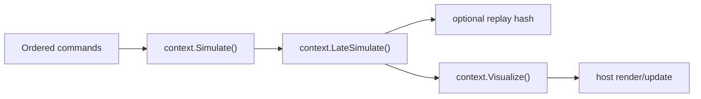

# Host Integration

Gravitas does not own your application loop. A game engine, server,
deterministic simulation harness, or unit test creates the host objects and calls
Gravitas at deterministic points.

This page is the practical starting point for wiring Gravitas into a host. For
runtime ownership details, read [Runtime Architecture](RUNTIME_ARCHITECTURE.md).
For replay and snapshot boundaries, read
[Serialization And Replay](SERIALIZATION.md).

## Quick Read

- Create or attach one `GravitasWorldContext` per simulation.
- Add GridForge grid coverage before registering colliders.
- Implement `IMatterAgent` to bridge host objects to context and
  `FixedTransform`.
- Use `SolidBody`/`LSCollider` for 3D and `SolidBody2D`/`LSCollider2D` for 2D.
- Apply deterministic commands before `context.Simulate()`.
- Call `context.Simulate()` and `context.LateSimulate()` from the authoritative
  fixed step.
- Use `context.Visualize()` and `context.LateVisualize()` only for
  presentation.
- Deactivate bodies and colliders before pooling or destroying host wrappers.



## Public Surface

| Need | Use |
| --- | --- |
| Create an owned world | `GravitasWorldContext.CreateOwned(...)` |
| Attach a host-owned world | `GravitasWorldContext.Attach(world, takeOwnership)` |
| Bind a host object | `IMatterAgent` |
| Register a 3D body | `new SolidBody(agent, collider).Initialize(...)` |
| Register a 2D body | `new SolidBody2D(agent, collider).Initialize(...)` |
| Register bodyless geometry | `collider.InitializeWithNoBody(agent)` |
| Set runtime mode | `context.Settings.RuntimeMode` |
| Run 3D constraints/ragdolls | `context.Constraints3D` |
| Run 2D constraints/ragdolls | `context.Constraints2D` |
| Query 3D, 2D, or mixed geometry | `context.Query3D`, `context.Query2D`, `context.QueryMixed` |
| Hash replay state | `context.ComputeReplayHash()` |
| Reset a session | `context.Reset()` |
| End a context | `context.Dispose()` |

## Lifecycle Contract

Use the LSF lifecycle names as a mental model, not as engine-specific APIs:

| Phase | Host responsibility | Gravitas call |
| --- | --- | --- |
| `Setup` | Create package defaults, host resources, and worlds. | Create or attach `GravitasWorldContext`. |
| `Initialize` | Bind agents, transforms, colliders, bodies, settings, and grids. | Initialize colliders and bodies. |
| `Execute` | Apply deterministic commands or network input in ordered frame batches. | No direct call. Mutate host-owned state before simulation. |
| `Simulate` | Advance the authoritative fixed step. | `context.Simulate()`. |
| `LateSimulate` | Finish deterministic end-of-frame work. | `context.LateSimulate()`. |
| `Visualize` | Interpolate or publish presentation state. | `context.Visualize()`. |
| `LateVisualize` | Finish presentation-only work. | `context.LateVisualize()`. |
| `Deactivate` | Pool/despawn agents and release registrations. | `body.Deactivate()` or `collider.Deactivate()`. |
| `Quit` | Shut down the host process/session. | `context.Dispose()` when the context is no longer needed. |

Authoritative simulation state belongs in `Simulate` and `LateSimulate`.
`Visualize` and `LateVisualize` are for interpolation and presentation; do not
use them to apply gameplay commands or physics corrections.

## Minimal Setup

### Host Agent

The host provides `IMatterAgent` so Gravitas can bind an object to a context and
fixed transform without depending on an engine, ECS, rendering, or a specific
object model.

```csharp
using FixedMathSharp;
using Gravitas;

internal sealed class HostMatterAgent : IMatterAgent
{
    public HostMatterAgent(
        GravitasWorldContext context,
        FixedTransform transform,
        bool isParent = true)
    {
        Context = context;
        Transform = transform;
        IsParent = isParent;
    }

    public GravitasWorldContext Context { get; }

    public FixedTransform Transform { get; }

    public bool IsParent { get; }

    public bool IsInteracting { get; set; }
}
```

`IsParent` marks whether an agent is intended to be a top-level hierarchy owner.
Hierarchy collision filtering is bound explicitly on colliders:

```csharp
weaponCollider.SetParent(characterCollider);
leftFootCollider.SetParent(characterCollider);
rightFootCollider.SetParent(characterCollider);
```

`SetParent(...)` stores a dimension-tagged top-parent collider key, so sibling
filtering does not depend on an engine transform hierarchy. Mixed mode can bind
2D colliders under 3D colliders, or the reverse, without aliasing the separate
collider ID tables. Use `ClearParent()` when a collider leaves the hierarchy
without being deactivated.

### Context And Grid

Use `CreateOwned(...)` when Gravitas should own the `GridWorld` lifetime:

```csharp
using Gravitas;

using GravitasWorldContext context = GravitasWorldContext.CreateOwned();
```

Use `Attach(...)` when the host creates and owns the `GridWorld`:

```csharp
using Gravitas;
using GridForge.Grids;

using GridWorld world = new();
using GravitasWorldContext context = GravitasWorldContext.Attach(world);
```

Pass `takeOwnership: true` to `Attach(...)` only when disposing the context
should also dispose the supplied world. One active `GridWorld` can be attached
to only one active `GravitasWorldContext`.

Colliders partition into existing GridForge voxels. Add grids that cover the
simulation area before initializing bodies and colliders:

```csharp
using FixedMathSharp;
using GridForge.Configuration;

context.World.TryAddGrid(
    new GridConfiguration(
        new Vector3d(-16, -4, -16),
        new Vector3d(16, 8, 16)),
    out _);
```

If no voxel exists for a collider's bounds, the collider cannot be distributed
into partitions and will not participate in partition-backed collision/query
work for that area.

### Dynamic 3D Body

Dynamic 3D matter usually has a host agent, one `LSCollider`, and one
`SolidBody`.

```csharp
using FixedMathSharp;
using Gravitas;
using Gravitas.Colliders;
using Gravitas.Materials;

FixedTransform transform = new(
    Vector3d.Zero,
    FixedQuaternion.Identity,
    Vector3d.One);

HostMatterAgent agent = new(context, transform);

LSSphereCollider collider = new();
collider.Material = new PhysicsMaterial(
    staticFriction: Fixed64.One,
    dynamicFriction: Fixed64.Half,
    restitution: Fixed64.FromFraction(1, 4));

SolidBody body = new(agent, collider)
{
    Mass = Fixed64.One
};

body.Initialize(Vector3d.Zero, FixedQuaternion.Identity, isDynamic: true);
```

Initialization binds the body and collider to `agent.Context`, allocates
context-local body/collider IDs, calculates runtime shape data, and partitions
the collider.

### 2D Body

2D scenes use the same host-agent shape, but select the 2D runtime path and
create 2D body/collider types:

```csharp
context.Settings.RuntimeMode = PhysicsRuntimeMode.TwoD;

LSCircleCollider2D collider = new(Fixed64.Half);
SolidBody2D body = new(agent, collider)
{
    Mass = Fixed64.One
};

body.Initialize(agent.Transform.Position.ToVector2d(), isDynamic: true);
```

The 2D projection uses the LSF X/Z convention: world X maps to 2D X and world Z
maps to 2D Y. World Y remains vertical height or mixed embedding metadata.

### Bodyless Geometry

Use `InitializeWithNoBody(...)` for static or trigger geometry that does not need
body-owned state:

```csharp
using Gravitas.Colliders;

LSCuboidCollider floor = new();
floor.InitializeWithNoBody(agent);
```

A body with all translation axes frozen is different from a bodyless collider.
Use `SolidBody.FreezeAxes = BodyFreezeAxes3D.Position` or
`SolidBody2D.FreezeAxes = BodyFreezeAxes2D.Position` when an object should keep
body state but behave as static-equivalent for solver and partition mobility.
Partial freezes remain dynamic and constrain only the selected axes.

If a bodyless 3D collider moves after initialization, the host must call
`collider.Simulate()` after mutating the transform so bounds and partition
membership refresh. 2D bodyless colliders rebuild from their agent
transform during the 2D broad-phase pass.

## Common Configuration

### Surface Materials

`PhysicsMaterial` is deterministic collider surface data. Assign it before
simulation when a surface needs explicit static friction, dynamic friction,
restitution, or combine policies:

```csharp
collider.Material = PhysicsMaterial.Frictionless;
```

Shape definitions and compound parts can also carry materials:

```csharp
var compound = new LSCompoundCollider(
    CompoundColliderPart.Sphere(
        Fixed64.Half,
        -Vector3d.Right,
        PhysicsMaterial.Bouncy),
    CompoundColliderPart.Cuboid(
        Vector3d.One,
        Vector3d.Right,
        PhysicsMaterial.Default));
```

Compound parts without an explicit material use the owning compound collider's
material when private part colliders are materialized.

### Local Physical Filtering

`IgnoredCollisionLayers` is a collider-owned physical filter:

```csharp
projectileCollider.Layer = new PhysicsLayer(3);
ownerCollider.IgnoredCollisionLayers =
    PhysicsLayerMask.FromLayer(projectileCollider.Layer);
```

The rule is symmetric at pair time: if either collider ignores the other
collider's layer, the physical interaction is rejected. This affects discrete
collision pairs, trigger pairs, internal CCD target eligibility, and
grounding/support acceptance. Public query services use the caller's
`PhysicsLayerMask` instead.

### Settings And Environment

Each context owns its own `PhysicsSettings` and `PhysicsEnvironment`.

```csharp
context.SetFrameRate(60);

PhysicsSettings settings = PhysicsSettings.DefaultSettings();
settings.PoolingEnabled = true;
settings.RestitutionVelocityThreshold = Fixed64.FromFraction(1, 4);
context.ApplySettings(settings);

context.Environment.Gravity = Fixed64.FromFraction(49, 5);
```

Different contexts can run at different frame rates and settings in the same
process. Frame-derived values such as `DeltaTime`, `FrameCount`, and
`TotalTime` are read through the context.

Per-body gravity tuning lives on the body. `SolidBody.GravityScale` multiplies
context gravity for that body; `Fixed64.Zero` disables environment-gravity
acceleration and grounded weight. `SolidBody2D.GravityScale` applies the same
policy to that body's planar gravity vector.

## Constraints And Ragdolls

`context.Constraints3D` owns deterministic 3D joints and ragdoll runtimes.
`context.Constraints2D` owns deterministic 2D joints and ragdoll runtimes.

| Domain | Runtime types | Joint shape | Solved with |
| --- | --- | --- | --- |
| 3D | `Joint3D`, `RagdollRuntime3D` | Local frames, angular axes, 3D motors/limits | 3D contact islands in `LateSimulate()` |
| 2D | `Joint2D`, `RagdollRuntime2D` | Planar anchors, scalar angles, scalar motors/limits | 2D contact islands in `LateSimulate()` |

3D example:

```csharp
using Gravitas.Constraints;

Joint3D shoulder = context.Constraints3D.RegisterJoint(new JointDefinition3D(
    upperArmBody,
    torsoBody,
    upperArmLocalFrame,
    torsoLocalFrame,
    JointType3D.ConeTwist,
    JointLimit3D.ConeTwist(maxConeAngle, maxTwistAngle),
    JointMotor3D.Disabled,
    JointCollisionPolicy.SuppressLinked));
```

2D example:

```csharp
using Gravitas.Constraints;

Joint2D hinge = context.Constraints2D.RegisterJoint(new JointDefinition2D(
    forearmBody2D,
    upperArmBody2D,
    new JointFrame2D(Vector2d.Right * Fixed64.Half, Fixed64.Zero),
    new JointFrame2D(-Vector2d.Right * Fixed64.Half, Fixed64.Zero),
    JointType2D.Pin,
    JointLimit2D.Angular(-Fixed64.HalfPi, Fixed64.HalfPi),
    JointMotor2D.Disabled,
    JointCollisionPolicy.SuppressLinked));
```

Enabled joints use `PhysicsSettings.DiscreteSolverIterations`. Linked sleep/wake
behavior follows the island graph. Linked-collider collision suppression affects
physical collision/CCD pair creation, not public query include-mask semantics.

Ragdolls are authoring conveniences over the same joint model:

```csharp
RagdollRuntime3D ragdoll = context.Constraints3D.RegisterRagdoll(
    new RagdollDefinition3D(
        links,
        joints,
        RagdollSelfCollisionPolicy.SuppressAdjacentLinks));

ragdoll.ActivateDynamic();
ragdoll.DeactivateToKinematic();
```

Animation, IK, pose selection, engine animator hooks, and blending remain host
or animation-package responsibilities. A deterministic animation package can
compute motor payloads and pass them before the fixed step.

## Fixed Loop

A simple deterministic loop looks like this:

```csharp
while (running)
{
    ApplyOrderedCommandsForFrame();

    context.Simulate();
    context.LateSimulate();

    context.Visualize();
    context.LateVisualize();
}
```

Most real hosts call `Simulate` and `LateSimulate` from a fixed-rate scheduler
and call visualization phases from the render/update loop.

The high-level order is:

1. `context.Simulate()` advances the clock, runs simulate-phase services,
   advances lockstep coroutines, and invokes simulate hooks.
2. `context.LateSimulate()` integrates bodies, processes CCD, refreshes
   partitions, distributes pairs, solves contacts and joints, refreshes
   grounding/support, handles mixed contacts when enabled, and invokes
   late-simulate hooks.
3. `context.Visualize()` updates visual/presentation transforms for enabled
   services and invokes visualize hooks.
4. `context.LateVisualize()` invokes hooks only.

For the 3D path, the fixed-step order is integrate-then-collide inside
`LateSimulate`: queued forces affect motion before the discrete collision pass
for that same frame.

For kinematic CCD, hosts must write deterministic target transforms before
`context.LateSimulate()`. Gravitas captures the body pose at the start of the
late step, reads the host transform as the requested target, and sweeps between
those two poses when continuous collision is enabled. The first static-style
blocker clips the kinematic pose and writes the clipped transform back to the
host binding.

## Queries And Grounding

2D, 3D, and mixed queries are explicit context services:

```csharp
using Gravitas.Queries;
using Gravitas.Support;
using SwiftCollections;

PhysicsLayerMask layerMask = PhysicsLayerMask.FromLayer(0);

bool rayHitFound = context.Query3D.Raycast(
    origin,
    direction,
    maxDistance,
    out Physics3DHit rayHit,
    layerMask);

SwiftList<Physics2DHit> planarHits = new();
int planarHitCount = context.Query2D.RaycastAll(
    start2D,
    end2D,
    layerMask,
    planarHits);

SwiftList<PhysicsMixedHit> mixedHits = new();
int mixedHitCount = context.QueryMixed.SweepSphereAgainst2DAll(
    origin,
    origin + direction * maxDistance,
    radius,
    layerMask,
    mixedHits,
    excludedCollider: null);
```

All-hit APIs use caller-owned buffers. Batch APIs use typed request spans,
caller-owned output spans or shared hit lists, and `PhysicsQueryHitRange`
buffers.

Ground checks use `context.Settings.GroundCheckLayerMask`; hosts should set this
explicitly for their layer model. `SolidBody.GroundingMode` and
`SolidBody2D.GroundingMode` can stay automatic or switch to manual host-owned
support through `UseManualGrounding(...)`, `SetManualGrounding(...)`,
`ClearManualGrounding()`, and `UseAutomaticGrounding(...)`.

Read [Query Services](QUERY_SERVICES.md) for the full query surface.

## Replay Contract

For deterministic runs, apply ordered commands before `context.Simulate()`.
Given the same initial context, settings, world state, command order, and frame
count, Gravitas should replay to the same authoritative body, collider, clock,
and contact state.

```csharp
using Chronicler;

context.Simulate();
context.LateSimulate();

ChronicleHash hash = context.ComputeReplayHash();
SendFrameHashToLockstepPeer(context.FrameCount, hash);
```

`ComputeReplayHash()` hashes context settings, physical environment values,
clock state, body state, collider shape/filter state, retained
continuation-affecting pair/contact state, and active CCD handoff state. It does
not hash host object identity, delegates, diagnostics buffers, debug draw
commands, query scratch buffers, or visualization interpolation caches.

The returned `ChronicleHash` is a deterministic conformance signal, not a
cryptographic hash and not a compatibility promise across package versions.

## Deactivation And Disposal

Deactivate runtime objects before pooling or destroying their host wrappers:

```csharp
body.Deactivate();
floor.Deactivate();
```

`SolidBody.Deactivate()` deactivates the collider, removes the body from the
physics service, and clears the dynamic ID. `LSCollider.Deactivate()` clears
partition membership, removes collision-pair references, clears explicit parent
binding, returns active pairs to the pool when enabled, and releases the
collider ID.

Use `context.Reset()` for a reusable session context. Reset detaches Gravitas
partition payloads from GridForge voxels and clears context-local runtime state
while preserving the world and its grids. Use `context.Dispose()` when the
context is finished.

## Rules That Matter

- Do not mutate authoritative physics state from visualization phases.
- Do not read wall-clock time from runtime simulation logic.
- Keep command ordering deterministic before `Simulate()`.
- Add grid coverage before initializing colliders.
- Keep public query buffers caller-owned in hot paths.
- Use explicit runtime modes: `ThreeD`, `TwoD`, `Both`, or `Mixed`.
- Use `Mixed` only when cross-dimensional contacts are intended.
- Treat Chronicler as populate-existing-shell infrastructure, not an object
  factory.

## Source Map

| Area | Source |
| --- | --- |
| Context and lifecycle | [`src/Gravitas/Runtime/GravitasWorldContext.cs`](../../src/Gravitas/Runtime/GravitasWorldContext.cs), [`src/Gravitas/Runtime/GravitasClock.cs`](../../src/Gravitas/Runtime/GravitasClock.cs) |
| Host boundary | [`src/Gravitas/Core/IMatterAgent.cs`](../../src/Gravitas/Core/IMatterAgent.cs) |
| 3D body/service | [`src/Gravitas/Core/3D/SolidBody.cs`](../../src/Gravitas/Core/3D/SolidBody.cs), [`src/Gravitas/Core/3D/GravitasPhysicsService.cs`](../../src/Gravitas/Core/3D/GravitasPhysicsService.cs) |
| 2D body/service | [`src/Gravitas/Core/2D/SolidBody2D.cs`](../../src/Gravitas/Core/2D/SolidBody2D.cs), [`src/Gravitas/Core/2D/GravitasPhysics2DService.cs`](../../src/Gravitas/Core/2D/GravitasPhysics2DService.cs) |
| Settings | [`src/Gravitas/Settings/PhysicsSettings.cs`](../../src/Gravitas/Settings/PhysicsSettings.cs), [`src/Gravitas/Settings/PhysicsRuntimeMode.cs`](../../src/Gravitas/Settings/PhysicsRuntimeMode.cs) |
| Constraints | [`src/Gravitas/Constraints/3D`](../../src/Gravitas/Constraints/3D), [`src/Gravitas/Constraints/2D`](../../src/Gravitas/Constraints/2D) |
| Query APIs | [`src/Gravitas/Queries`](../../src/Gravitas/Queries) |
| Replay hash | [`src/Gravitas/Determinism/GravitasReplayHashService.cs`](../../src/Gravitas/Determinism/GravitasReplayHashService.cs) |
