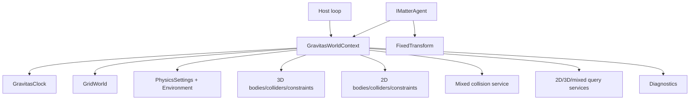

# Gravitas Overview

Gravitas is a deterministic, engine-agnostic physics library for lockstep
simulations and games. It uses FixedMathSharp for fixed-point math,
SwiftCollections for low-allocation runtime data structures, GridForge for
world/grid ownership, and context-owned Gravitas services for physics runtime
state.

The core runtime rule is simple: there is no process-wide physics world. A
simulation happens inside a `GravitasWorldContext`, and every body, collider,
partition, query, coroutine, diagnostic buffer, and clock value belongs to that
context.

## Quick Read

- Hosts own the outer loop, command ordering, rendering, networking, editor
  integration, and engine objects.
- Gravitas owns deterministic context-local physics state.
- `SolidBody`/`LSCollider` are the 3D path.
- `SolidBody2D`/`LSCollider2D` are the 2D path.
- `PhysicsRuntimeMode.Both` runs 2D and 3D side by side without mixed contacts.
- `PhysicsRuntimeMode.Mixed` enables explicit 2D/3D contacts, queries, CCD, and
  diagnostics.
- Chronicler populates host-created runtime shells; it does not construct the
  object graph.
- Diagnostics are data streams; host adapters translate them outside the core
  runtime.

## Foundation Libraries

Gravitas is the physics layer of a small deterministic stack. Read the sibling
project docs when you need the lower-level contracts behind a Gravitas API.

| Library          | What Gravitas uses it for                                                                                        | More                                          |
| ---------------- | ---------------------------------------------------------------------------------------------------------------- | --------------------------------------------- |
| FixedMathSharp   | `Fixed64`, deterministic vectors, quaternions, transforms, matrices, bounds, rays, planes, and geometry helpers. | [README](../../../FixedMathSharp/README.md)   |
| SwiftCollections | Low-allocation lists, sets, queues, pools, and caller-owned buffers used by hot-path services and query APIs.    | [README](../../../SwiftCollections/README.md) |
| GridForge        | Explicit `GridWorld` ownership, voxel identities, traversal, partition backing, and spatial candidate gathering. | [README](../../../GridForge/README.md)        |

## Reading Path

| Need                                                          | Read                                                                |
| ------------------------------------------------------------- | ------------------------------------------------------------------- |
| Wire Gravitas into a host loop                                | [Host Integration](HOST_INTEGRATION.md)                             |
| Understand context services, lifecycle, and ownership         | [Runtime Architecture](RUNTIME_ARCHITECTURE.md)                     |
| Choose between 2D, 3D, `Both`, and `Mixed`                    | [2D, 3D, And Runtime Modes](DIMENSIONS.md)                          |
| Understand collision at a high level                          | [Collision Pipeline](COLLISION_PIPELINE.md)                         |
| Work on partitioning and candidate pairs                      | [Collision Broad Phase](COLLISION_BROAD_PHASE.md)                   |
| Work on collider geometry, meshes, compounds, or narrow phase | [Collider Shape Reference](COLLIDER_SHAPE_REFERENCE.md)             |
| Work on tunneling, sweeps, TOI, or kinematic active sources   | [Continuous Collision Detection](CONTINUOUS_COLLISION_DETECTION.md) |
| Work on contacts, materials, warm starts, sleep, or events    | [Collision Response](COLLISION_RESPONSE.md)                         |
| Use public queries                                            | [Query Services](QUERY_SERVICES.md)                                 |
| Work on query reducers, batching, or hit details              | [Query Reference](QUERY_REFERENCE.md)                               |
| Change save/load, replay, or hash behavior                    | [Serialization And Replay](SERIALIZATION.md)                        |
| Add or consume diagnostics                                    | [Diagnostics](DIAGNOSTICS.md)                                       |
| Build host-side debug/log/replay adapters                     | [Diagnostic Adapters](DIAGNOSTIC_ADAPTERS.md)                       |

## Core Mental Model

The host owns:

- the application loop and deterministic command/input ordering.
- renderers, ECS, engine objects, networking, pooling, and editor tooling.
- the `GridWorld` when using `GravitasWorldContext.Attach(...)`.
- host objects that implement `IMatterAgent`.
- serialization shell construction before Chronicler populates state.

Gravitas owns, per context:

- fixed-step timing through `GravitasClock`.
- settings and physical environment values.
- 3D bodies, colliders, constraints, ragdolls, pairs, response, and queries.
- 2D bodies, colliders, constraints, ragdolls, pairs, response, and queries.
- mixed 2D/3D candidate gathering, pairs, constrained response, CCD, queries,
  and diagnostics when `PhysicsRuntimeMode.Mixed` is active.
- GridForge-backed partition payloads and retained partition cleanup.
- lockstep coroutines and lifecycle hooks.
- deterministic replay hashing.
- diagnostic event and debug draw buffers when enabled.

## Main Types

| Type                            | Role                                                                                                                                                   |
| ------------------------------- | ------------------------------------------------------------------------------------------------------------------------------------------------------ |
| `GravitasWorldContext`          | Owns one active `GridWorld` plus all context-local runtime services.                                                                                   |
| `IMatterAgent`                  | Host boundary for context, fixed transform, hierarchy intent, and interaction state.                                                                   |
| `SolidBody`                     | 3D body state: position, rotation, motion, mass, inertia, grounding, CCD, sleep, visualization publishing, and Chronicler recording.                   |
| `SolidBody2D`                   | 2D body state: X/Z position, scalar yaw, planar motion, scalar inertia, support state, CCD, sleep, visualization publishing, and Chronicler recording. |
| `LSCollider`                    | 3D collider identity, shape, bounds, layer/filter state, material, partition state, pairs, and events.                                                 |
| `LSCollider2D`                  | 2D collider identity, X/Z shape/bounds, layer/filter state, material, partition state, mixed slab state, pairs, and events.                            |
| `PhysicsRuntimeMode`            | Validated runtime routing: `ThreeD`, `TwoD`, `Both`, or `Mixed`.                                                                                       |
| `GravitasPhysicsService`        | 3D body/collider registration, CCD, pair ownership, response islands, sleep, and visualization.                                                        |
| `GravitasPhysics2DService`      | 2D body/collider registration, CCD, pair ownership, response islands, planar support, sleep, and visualization.                                        |
| `GravitasMixedCollisionService` | Mixed broad phase, pair lifecycle, constrained response, CCD handoff, retained partition cleanup, and diagnostics.                                     |
| `GravitasConstraint3DService`   | 3D joints, ragdolls, linked-collider filtering, motor handoff, replay hashing, and metrics.                                                            |
| `GravitasConstraint2DService`   | 2D joints, ragdolls, linked-collider filtering, motor handoff, replay hashing, and metrics.                                                            |
| `GravitasQuery3DService`        | 3D raycasts, swept-sphere and convex-source sweeps, cone volumes, and X/Z projected-circle overlaps.                                                   |
| `GravitasQuery2DService`        | 2D overlaps, segment raycasts, swept-circle queries, batching, and hit ordering.                                                                       |
| `GravitasQueryMixedService`     | Explicit mixed sphere-against-2D and circle-against-3D sweeps.                                                                                         |
| `GravitasDiagnosticSink`        | Disabled-by-default context diagnostics for events and renderer-neutral debug draw commands.                                                           |

## Typical Flow

1. Create or attach a `GravitasWorldContext`.
2. Configure the underlying `GridWorld` with GridForge grids covering the
   simulation space.
3. Expose host objects through `IMatterAgent.Context` and
   `IMatterAgent.Transform`.
4. Create colliders and bodies.
5. Initialize runtime objects so Gravitas can allocate context-local IDs,
   calculate runtime shape data, and partition colliders.
6. Apply deterministic commands for the frame.
7. Call `context.Simulate()` and `context.LateSimulate()` from the fixed step.
8. Optionally compute `context.ComputeReplayHash()` for lockstep/replay
   validation.
9. Call `context.Visualize()` and `context.LateVisualize()` from presentation
   timing.
10. Deactivate objects before pooling/despawn and reset or dispose the context
    at session boundaries.

## Runtime Surface

| Area          | Supported surface                                                                                                                                                                          |
| ------------- | ------------------------------------------------------------------------------------------------------------------------------------------------------------------------------------------ |
| 3D            | primitive, mesh, and compound colliders; explicit dynamic/kinematic/static bodies; CCD; constraints; ragdolls; grounding; queries; diagnostics; replay.                                           |
| 2D            | circle, capsule, AABB, convex polygon, and compound colliders; planar body dynamics; scalar angular response; grounding/support; CCD; constraints; ragdolls; queries; diagnostics; replay. |
| Mixed 2D/3D   | embedded 2D slabs, mixed broad phase, mixed pairs, constrained response, explicit mixed queries, mixed CCD hooks, dimension-tagged diagnostics, slab debug draw.                           |
| Collision     | deterministic broad phase, narrow phase, manifolds, response islands, warm starts, materials, sleep/wake, notifications, cleanup.                                                          |
| Queries       | closest/all-hit and batch APIs for 3D, 2D, and mixed query families with caller-owned buffers.                                                                                             |
| Serialization | Chronicler populate-existing-shell state transfer and replay hash conformance.                                                                                                             |
| Diagnostics   | deterministic event streams, debug draw commands, typed views, visitors, and host adapter patterns.                                                                                        |

## Intentional Boundaries

These are deliberate public-runtime boundaries:

- `PhysicsRuntimeMode.Both` does not create mixed contacts. Use
  `PhysicsRuntimeMode.Mixed` for cross-dimensional collision.
- Mixed-dimension joints are not part of the articulated-body model. Use 3D
  joints with `SolidBody` and 2D joints with `SolidBody2D`.
- Concave mesh source sweeps and raw mesh source query APIs are not exposed.
  Author concave-looking movers as stable convex compound parts.
- Public query services are same-thread per context service and reuse
  service-owned scratch.
- Renderer, editor, logging, and replay UI integrations live in host adapters,
  not in `src/Gravitas`.
- Chronicler loading populates existing shells; it does not create engines,
  transforms, worlds, bodies, or colliders from data.

## Source Map

| Area                     | Source                                                                                                                                                                                                                                                                                                 |
| ------------------------ | ------------------------------------------------------------------------------------------------------------------------------------------------------------------------------------------------------------------------------------------------------------------------------------------------------ |
| Context and lifecycle    | [`src/Gravitas/Runtime/GravitasWorldContext.cs`](../../src/Gravitas/Runtime/GravitasWorldContext.cs), [`src/Gravitas/Runtime/GravitasClock.cs`](../../src/Gravitas/Runtime/GravitasClock.cs), [`src/Gravitas/Runtime/GravitasLifecycleHooks.cs`](../../src/Gravitas/Runtime/GravitasLifecycleHooks.cs) |
| Host boundary and bodies | [`src/Gravitas/Core/IMatterAgent.cs`](../../src/Gravitas/Core/IMatterAgent.cs), [`src/Gravitas/Core/3D/SolidBody.cs`](../../src/Gravitas/Core/3D/SolidBody.cs), [`src/Gravitas/Core/2D/SolidBody2D.cs`](../../src/Gravitas/Core/2D/SolidBody2D.cs)                                                     |
| Physics services         | [`src/Gravitas/Core/3D`](../../src/Gravitas/Core/3D), [`src/Gravitas/Core/2D`](../../src/Gravitas/Core/2D), [`src/Gravitas/Core/Mixed`](../../src/Gravitas/Core/Mixed)                                                                                                                                 |
| Colliders                | [`src/Gravitas/Colliders`](../../src/Gravitas/Colliders)                                                                                                                                                                                                                                               |
| Collision handling       | [`src/Gravitas/CollisionHandling`](../../src/Gravitas/CollisionHandling)                                                                                                                                                                                                                               |
| Constraints              | [`src/Gravitas/Constraints/3D`](../../src/Gravitas/Constraints/3D), [`src/Gravitas/Constraints/2D`](../../src/Gravitas/Constraints/2D)                                                                                                                                                                 |
| Queries                  | [`src/Gravitas/Queries`](../../src/Gravitas/Queries)                                                                                                                                                                                                                                                   |
| Serialization and replay | [`src/Gravitas/Determinism`](../../src/Gravitas/Determinism), [`src/Gravitas/Settings/PhysicsSettingsSaver.cs`](../../src/Gravitas/Settings/PhysicsSettingsSaver.cs)                                                                                                                                   |
| Diagnostics              | [`src/Gravitas/Diagnostics`](../../src/Gravitas/Diagnostics)                                                                                                                                                                                                                                           |
| Tests and benchmarks     | [`tests/Gravitas.Tests`](../../tests/Gravitas.Tests), [`tests/Gravitas.Benchmarks`](../../tests/Gravitas.Benchmarks)                                                                                                                                                                                   |
