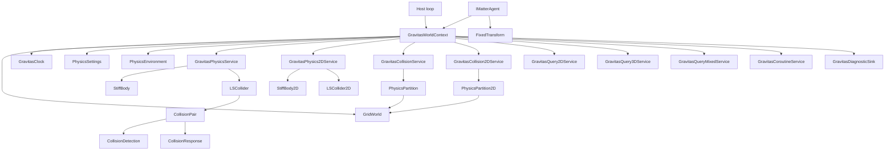

# Gravitas Overview

Gravitas is a deterministic, engine-agnostic physics library for lockstep
simulations. It is built on fixed-point math, explicit GridForge worlds, and
context-owned runtime services. The important runtime rule is simple: there is
no process-wide physics world. A simulation happens inside a
`GravitasWorldContext`, and every body, collider, partition, query, coroutine,
and clock value belongs to that context.

This wiki is written for developers working on or integrating the library. The
public surface should stay lean; most of the useful context is how the internal
systems connect, which runtime contracts are intentional, and which boundaries
are explicit design choices rather than accidental gaps.

## Reading Path

- Start here for the mental model and the system map.
- Read [Host Integration](HOST_INTEGRATION.md) when wiring Gravitas into a game
  loop, server loop, test harness, or simulation runner.
- Read [Runtime Architecture](RUNTIME_ARCHITECTURE.md) when changing context
  ownership, settings, timing, registration, or lifecycle ordering.
- Read [Collision Pipeline](COLLISION_PIPELINE.md) when changing broad-phase
  partitioning, collision pairs, narrow-phase detection, contact data, or
  response behavior.
- Read [Dimensions](DIMENSIONS.md) when changing 2D, 3D, or mixed 2D/3D
  body, collider, bounds, collision, response, or query behavior.
- Read [Query Services](QUERY_SERVICES.md) when changing raycasts, circle
  overlap queries, hit ordering, layer filtering, or query allocation behavior.
- Read [Serialization And Replay](SERIALIZATION.md) when changing Chronicler
  record data, settings snapshots, populate-existing-shell behavior, or replay
  validation.
- Read [Diagnostics](DIAGNOSTICS.md) when changing diagnostic events, debug draw
  commands, host debug adapters, or instrumentation overhead.
- Read [Diagnostic Adapters](DIAGNOSTIC_ADAPTERS.md) when translating
  diagnostics into engine-specific draw, log, or replay tooling outside the core
  runtime.

## Core Mental Model

Gravitas separates the host loop from deterministic physics state.

The host owns:

- the outer lifecycle and command/input ordering.
- any renderer, ECS, engine object, networking, pooling, or editor integration.
- the `GridWorld` when using `GravitasWorldContext.Attach(...)`.
- host objects that implement `IMatterAgent`.

Gravitas owns, per context:

- fixed-step timing through `GravitasClock`.
- world-local settings and environment values.
- dynamic body and collider registration.
- pure 2D body, collider, pair, response, and query state.
- collision partitions and collision-pair state.
- raycast, circle-overlap, and coroutine buffers.
- swept-sphere query buffers.
- deterministic diagnostic event and debug draw buffers when enabled.
- ordered lifecycle hooks.

## Main Types

| Type | Role |
| --- | --- |
| `GravitasWorldContext` | Owns one active `GridWorld` plus all context-local runtime services. |
| `IMatterAgent` | Host boundary. Supplies context, fixed transform, hierarchy state, and interaction state. |
| `StiffBody` | Simulated 3D body state: position, rotation, velocity, acceleration, mass, grounding, impulses, sleep/wake state, visual publishing, and Chronicler authoritative-state recording. |
| `StiffBody2D` | Pure 2D body state: X/Z-projected position, scalar rotation, linear velocity, force integration, gravity, sleep/wake state, host agent binding, visualization publishing, and Chronicler authoritative-state recording. |
| `LSCollider` | Base collider state: shape, bounds, layer, trigger/contact events, partition coordinates, pair references, and context binding. |
| `LSCollider2D` | Base pure 2D collider state for circle, axis-aligned box, and convex polygon shapes. |
| `PhysicsRuntimeMode` | Validated bitmask selecting `TwoD`, `ThreeD`, `Both`, or `Mixed` runtime routing. |
| `GravitasPhysicsService` | Body/collider registration, context-local collider IDs, collision-pair pooling, simulation phases, and visualization phases. |
| `GravitasPhysics2DService` | Pure 2D registration, collider IDs, narrow phase, response, events, and visualization publishing. |
| `GravitasCollisionService` | GridForge-backed broad-phase partitioning, active partition tracking, partition pooling, and collision distribution versioning. |
| `GravitasCollision2DService` | GridForge-backed pure 2D X/Z broad-phase partitioning, active partition tracking, partition pooling, duplicate suppression, and collision distribution versioning. |
| `GravitasMixedCollisionService` | Mixed 2D/3D lifecycle and broad-phase candidate gathering through `PhysicsMixedPartition`, stable 3D/2D keys, duplicate suppression, and retained partition cleanup. |
| `GravitasQuery2DService` | Pure 2D overlap-circle and segment raycast queries, caller-buffered hit output, duplicate suppression, and hit ordering. |
| `GravitasQuery3DService` | 3D raycast, swept-sphere, convex-source sweep, and X/Z circle overlap/proximity queries, caller-buffered hit output, duplicate suppression, and hit ordering. |
| `GravitasQueryMixedService` | Explicit mixed 3D/2D swept-sphere and swept-circle queries, GridForge-backed mixed candidate gathering, caller-buffered hit output, and deterministic hit ordering. |
| `PhysicsPartition` | Voxel partition payload containing collider IDs, awake dynamic membership, and candidate pair distribution. |
| `CollisionPair` | Pair identity, culling state, contact state, warm-start cache, narrow-phase dispatch, response dispatch, and contact notification state. |
| `CollisionDetection` | Shape-pair narrow-phase collision checks and contact generation. |
| `CollisionResponse` | Deterministic manifold position correction, normal impulse, friction, and warm-started response for colliding bodies. |
| `GravitasCoroutineService` | Lockstep coroutine execution and context-bound wait instructions. |
| `GravitasDiagnosticSink` | Disabled-by-default context diagnostics for deterministic events and engine-agnostic debug draw commands. |

## Typical Flow

1. The host creates or attaches a `GravitasWorldContext`.
2. The host configures the underlying `GridWorld` with GridForge grids covering
   the simulation space.
3. Host objects expose `IMatterAgent.Context` and `IMatterAgent.Transform`.
4. Dynamic objects create a collider and a `StiffBody`, then call
   `StiffBody.Initialize(...)`.
5. Body initialization registers the body with `GravitasPhysicsService`,
   registers the collider, calculates runtime shape data, and partitions the
   collider into GridForge voxels.
6. Each fixed frame, the host calls `context.Simulate()` and
   `context.LateSimulate()`.
7. Each render or presentation frame, the host calls `context.Visualize()` and
   `context.LateVisualize()`.
8. On pooling, despawn, session reset, or shutdown, the host deactivates objects
   and disposes or resets the context.

Pure 2D scenes use the same context and clock, set
`context.Settings.RuntimeMode` to `PhysicsRuntimeMode.TwoD`, then create
`LSCollider2D` shapes and `StiffBody2D` bodies from host `IMatterAgent`
instances. The current 2D path supports circles, axis-aligned boxes, convex
polygons, bodyless static/trigger colliders, deterministic collision response,
contact events, sleep/wake behavior, replay tests, circle/AABB/polygon overlap
queries, segment raycasts, and swept-circle queries. `PhysicsRuntimeMode.Both`
runs pure 2D and pure 3D side by side without cross-dimensional contacts, while
`PhysicsRuntimeMode.Mixed` enables the dedicated mixed lifecycle, broad-phase,
narrow-phase, and constrained response path.

## Collision In One Breath

Colliders calculate bounds and are mapped into GridForge voxels by
`GravitasCollisionService`. Each occupied voxel can hold a `PhysicsPartition`.
Partitions store context-local collider IDs and are active when they contain
dynamic objects. During the 3D `LateSimulate` path, dynamic bodies integrate,
their colliders refresh partition membership, and active partitions distribute
candidates from awake dynamic membership so fully sleeping partitions can skip
pair generation without removing sleeping colliders from queries or contact
lifecycle.
`GravitasPhysicsService` filters candidates by context, active state, shape,
layer matrix, dynamic/static rules, and sibling relationships. A `CollisionPair`
then performs fast distance/AABB culling before dispatching to
`CollisionDetection`. If the narrow phase finds contact, it writes a fixed-size
`ContactManifold`; if the pair has bodies that should receive physics, the 3D
discrete response pass orders pairs into deterministic islands, applies cached
warm-start impulses, runs bounded response iterations where needed, applies
solver-side position correction, normal impulses, and friction impulses across
the manifold contacts, then stores pair-local warm-start impulse data by contact
identity. Contact events are emitted from the active-pair queue during
`LateSimulate`.

## Current Runtime Boundaries

- The 3D path remains the deepest runtime path. The pure 2D path
  supports circle, axis-aligned box, convex polygon, compound colliders, exact
  area/raycast/swept-circle queries, two-contact manifolds, scalar angular
  response, and pair-local warm-started response coverage.
- `StiffBody` has a split 2D ground position plus height for the 3D
  y-up model, but that is not the pure 2D body model.
- Mixed 2D/3D interaction has a dedicated runtime implementation. The runtime
  has a `Mixed` lifecycle path and 2D colliders cache finite 3D embedding bounds
  from `PhysicsSettings.Mixed2DHalfThickness`,
  `MixedHalfThicknessOverride`, and the host transform's Y position. Mixed
  broad phase gathers deterministic GridForge-backed 3D/2D candidate keys,
  and mixed narrow phase covers 3D spheres, cuboids, capsules, and finite
  cylinders plus compound and mesh colliders against embedded 2D circle, AABB,
  and convex polygon slabs. Mixed pair ownership and constrained response
  support wake propagation, resting-pair retention, mixed contact/trigger
  events, planar X/Z impulse for 2D bodies, and vertical response against 3D
  participants only. Mixed query APIs, mixed CCD hooks, dimension-tagged
  diagnostics, and slab debug draw are implemented; mixed 2D swept-circle
  queries cover primitive, mesh, and compound 3D targets while preserving pure
  2D semantics and labeling exact versus conservative fallback hits.
- Cylinder collision and query behavior is implemented for the current finite
  cylinder model. Cap/face contact manifolds preserve flat finite-cylinder
  behavior; side/rim contacts remain representative finite-cylinder contacts.
- Mesh raycast overlap, sphere sweeps against mesh targets, and concave mesh
  narrow phase are implemented through triangle-level tests. Mesh/cuboid and
  mesh/cylinder face/cap contacts clip stable support contacts to authored
  triangles. Capsule, cuboid, finite-cylinder, convex mesh, and authored
  compound sources have explicit 3D swept query APIs; concave mesh sources and
  raw mesh source queries are rejected because they hide unbounded
  source-triangle expansion. Hosts that need concave-looking movers should use
  offline convex decomposition into stable `LSCompoundCollider` parts.
- Collision response has deterministic 3D, pure 2D, and mixed response paths.
  The 3D and pure 2D manifold solvers handle normal and friction impulses,
  compatible pair-local warm-start impulses, deterministic response islands, and
  bounded multi-iteration solving where needed. Mixed response builds dedicated
  dimension-bridging islands without merging them into pure 2D or 3D islands.
  Body-owned CCD has shape-exact static-style, rotational, and pure-dynamic
  relative reducers for supported 2D and 3D families, while service-level CCD
  handoff queues advance chained dynamic TOI contacts and mixed dynamic velocity
  transfer across pure services.
- Query services use context-owned mutable buffers. Treat them as same-thread,
  fixed-loop services unless they are redesigned for reentrancy.
- Diagnostics are context-owned and disabled by default. Enabled draw capture can
  produce large buffers for meshes, so hosts should reserve capacity or filter
  capture scope.

## Where To Start In Source

| Area | Files |
| --- | --- |
| Context and lifecycle | [`GravitasWorldContext.cs`](../../src/Gravitas/Runtime/GravitasWorldContext.cs), [`GravitasClock.cs`](../../src/Gravitas/Runtime/GravitasClock.cs), [`GravitasLifecycleHooks.cs`](../../src/Gravitas/Runtime/GravitasLifecycleHooks.cs) |
| Host boundary and bodies | [`IMatterAgent.cs`](../../src/Gravitas/Core/IMatterAgent.cs), [`StiffBody.cs`](../../src/Gravitas/Core/3D/StiffBody.cs), [`StiffBody2D.cs`](../../src/Gravitas/Core/2D/StiffBody2D.cs) |
| Physics services | [`GravitasPhysicsService.cs`](../../src/Gravitas/Core/3D/GravitasPhysicsService.cs), [`GravitasPhysics2DService.cs`](../../src/Gravitas/Core/2D/GravitasPhysics2DService.cs), [`GravitasMixedCollisionService.cs`](../../src/Gravitas/Core/Mixed/GravitasMixedCollisionService.cs) |
| Collision broad phase | [`GravitasCollisionService.cs`](../../src/Gravitas/Core/3D/GravitasCollisionService.cs), [`GravitasCollision2DService.cs`](../../src/Gravitas/Core/2D/GravitasCollision2DService.cs), [`PhysicsPartition.cs`](../../src/Gravitas/Partitions/PhysicsPartition.cs) |
| Colliders | [`LSCollider.cs`](../../src/Gravitas/Colliders/Primitives/LSCollider.cs), [`Primitives`](../../src/Gravitas/Colliders/Primitives), [`Primitives2D`](../../src/Gravitas/Colliders/Primitives2D) |
| Collision handling | [`CollisionPair.cs`](../../src/Gravitas/CollisionHandling/Pairs/CollisionPair.cs), [`CollisionPair2D.cs`](../../src/Gravitas/CollisionHandling/Pairs/CollisionPair2D.cs), [`CollisionDetection.cs`](../../src/Gravitas/CollisionHandling/Detection/CollisionDetection.cs), [`CollisionDetection2D.cs`](../../src/Gravitas/CollisionHandling/Detection/CollisionDetection2D.cs), [`CollisionResponse.cs`](../../src/Gravitas/CollisionHandling/Response/CollisionResponse.cs), [`CollisionResponse2D.cs`](../../src/Gravitas/CollisionHandling/Response/CollisionResponse2D.cs) |
| 2D/3D direction | [`DIMENSIONS.md`](DIMENSIONS.md) |
| Serialization and replay | [`SERIALIZATION.md`](SERIALIZATION.md), [`StiffBody.cs`](../../src/Gravitas/Core/3D/StiffBody.cs), [`StiffBody2D.cs`](../../src/Gravitas/Core/2D/StiffBody2D.cs), [`PhysicsSettingsSaver.cs`](../../src/Gravitas/Settings/PhysicsSettingsSaver.cs) |
| Queries | [`GravitasQuery2DService.cs`](../../src/Gravitas/Queries/GravitasQuery2DService.cs), [`GravitasQuery3DService.Raycast.cs`](../../src/Gravitas/Queries/GravitasQuery3DService.Raycast.cs), [`GravitasQuery3DService.Circle.cs`](../../src/Gravitas/Queries/GravitasQuery3DService.Circle.cs), [`GravitasQueryMixedService.cs`](../../src/Gravitas/Queries/GravitasQueryMixedService.cs), [`QueryDetection2D.cs`](../../src/Gravitas/Queries/QueryDetection2D.cs) |
| Diagnostics | [`Diagnostics`](../../src/Gravitas/Diagnostics) |
| Tests and examples | [`tests/Gravitas.Tests`](../../tests/Gravitas.Tests), [`tests/Gravitas.Benchmarks`](../../tests/Gravitas.Benchmarks) |
