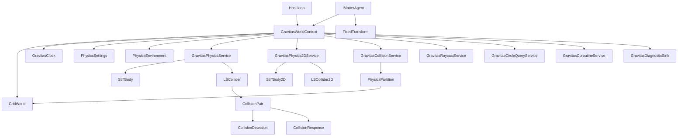

# Gravitas Overview

Gravitas is a deterministic, engine-agnostic physics prototype for lockstep
simulations. It is built on fixed-point math, explicit GridForge worlds, and
context-owned runtime services. The important post-refactor rule is simple:
there is no process-wide physics world. A simulation happens inside a
`GravitasWorldContext`, and every body, collider, partition, query, coroutine,
and clock value belongs to that context.

This wiki is written for developers working on or integrating the library. The
public surface should stay lean; most of the useful context is how the internal
systems connect and where the current prototype needs hardening.

## Reading Path

- Start here for the mental model and the system map.
- Read [Host Integration](HOST_INTEGRATION.md) when wiring Gravitas into a game
  loop, server loop, test harness, or simulation runner.
- Read [Runtime Architecture](RUNTIME_ARCHITECTURE.md) when changing context
  ownership, settings, timing, registration, or lifecycle ordering.
- Read [Collision Pipeline](COLLISION_PIPELINE.md) when changing broad-phase
  partitioning, collision pairs, narrow-phase detection, contact data, or
  response behavior.
- Read [Dimensions](DIMENSIONS.md) when changing 2D, 3D, or future mixed 2D/3D
  body, collider, bounds, collision, response, or query behavior.
- Read [Query Services](QUERY_SERVICES.md) when changing raycasts, circle
  overlap queries, hit ordering, layer filtering, or query allocation behavior.
- Read [Diagnostics](DIAGNOSTICS.md) when changing diagnostic events, debug draw
  commands, host debug adapters, or instrumentation overhead.

## Core Mental Model

Gravitas separates the host loop from deterministic physics state.

The host owns:

- the outer lifecycle and command/input ordering.
- any renderer, ECS, engine object, networking, pooling, or editor integration.
- the `GridWorld` when using `GravitasWorldContext.Attach(...)`.
- host objects that implement `IMatterAgent`.

Gravitas owns, per context:

- fixed-step timing through `GravitasClock`.
- world-local settings and environment values.
- dynamic body and collider registration.
- pure 2D body, collider, pair, response, and query state.
- collision partitions and collision-pair state.
- raycast, circle-overlap, and coroutine buffers.
- swept-sphere query buffers.
- deterministic diagnostic event and debug draw buffers when enabled.
- ordered lifecycle hooks.

## Main Types

| Type | Role |
| --- | --- |
| `GravitasWorldContext` | Owns one active `GridWorld` plus all context-local runtime services. |
| `IMatterAgent` | Host boundary. Supplies context, fixed transform, hierarchy state, and interaction state. |
| `StiffBody` | Simulated body state: position, rotation, velocity, acceleration, mass, grounding, impulses, sleep/wake state, interpolation, and Chronicler record data. |
| `StiffBody2D` | Pure 2D body state: X/Z-projected position, scalar rotation, linear velocity, force integration, gravity, sleep/wake state, host agent binding, and Chronicler record data. |
| `LSCollider` | Base collider state: shape, bounds, layer, trigger/contact events, partition coordinates, pair references, and context binding. |
| `LSCollider2D` | Base pure 2D collider state for circle, axis-aligned box, and convex polygon shapes. |
| `PhysicsRuntimeMode` | Selects whether a context advances the pure 2D or 3D runtime path. Mixed mode is intentionally deferred. |
| `GravitasPhysicsService` | Body/collider registration, context-local collider IDs, collision-pair pooling, simulation phases, and visualization phases. |
| `GravitasPhysics2DService` | Pure 2D registration, collider IDs, sweep-and-prune broad phase, narrow phase, response, events, and overlap-circle queries. |
| `GravitasCollisionService` | GridForge-backed broad-phase partitioning, active partition tracking, partition pooling, and collision distribution versioning. |
| `PhysicsPartition` | Voxel partition payload containing collider IDs, awake dynamic membership, and candidate pair distribution. |
| `CollisionPair` | Pair identity, culling state, contact state, warm-start cache, narrow-phase dispatch, response dispatch, and contact notification state. |
| `CollisionDetection` | Shape-pair narrow-phase collision checks and contact generation. |
| `CollisionResponse` | Prototype position correction and impulse response for colliding bodies. |
| `GravitasRaycastService` | Context-local raycast and swept-sphere buffers, candidate gathering, duplicate suppression, and hit ordering. |
| `GravitasCircleQueryService` | Context-local X/Z circle overlap and proximity query buffers and hit ordering. |
| `GravitasCoroutineService` | Lockstep coroutine execution and context-bound wait instructions. |
| `GravitasDiagnosticSink` | Disabled-by-default context diagnostics for deterministic events and engine-agnostic debug draw commands. |

## Typical Flow

1. The host creates or attaches a `GravitasWorldContext`.
2. The host configures the underlying `GridWorld` with GridForge grids covering
   the simulation space.
3. Host objects expose `IMatterAgent.Context` and `IMatterAgent.Transform`.
4. Dynamic objects create a collider and a `StiffBody`, then call
   `StiffBody.Initialize(...)`.
5. Body initialization registers the body with `GravitasPhysicsService`,
   registers the collider, calculates runtime shape data, and partitions the
   collider into GridForge voxels.
6. Each fixed frame, the host calls `context.Simulate()` and
   `context.LateSimulate()`.
7. Each render or presentation frame, the host calls `context.Visualize()` and
   `context.LateVisualize()`.
8. On pooling, despawn, session reset, or shutdown, the host deactivates objects
   and disposes or resets the context.

Pure 2D scenes use the same context and clock, set
`context.Settings.RuntimeMode` to `PhysicsRuntimeMode.TwoD`, then create
`LSCollider2D` shapes and `StiffBody2D` bodies from host `IMatterAgent`
instances. The current 2D path supports circles, axis-aligned boxes, convex
polygons, bodyless static/trigger colliders, deterministic collision response,
contact events, sleep/wake behavior, replay tests, and overlap-circle queries.
Mixed 2D/3D contacts are intentionally not part of this flow yet.

## Collision In One Breath

Colliders calculate bounds and are mapped into GridForge voxels by
`GravitasCollisionService`. Each occupied voxel can hold a `PhysicsPartition`.
Partitions store context-local collider IDs and are active when they contain
dynamic objects. During `Simulate`, active partitions distribute candidates from
awake dynamic membership so fully sleeping partitions can skip pair generation
without removing sleeping colliders from queries or contact lifecycle.
`GravitasPhysicsService` filters candidates by context, active state, shape,
layer matrix, dynamic/static rules, and sibling relationships. A `CollisionPair`
then performs fast distance/AABB culling before dispatching to
`CollisionDetection`. If the narrow phase finds contact, it writes a fixed-size
`ContactManifold`; if the pair has bodies that should receive physics,
`CollisionResponse` applies solver-side position correction, normal impulses,
and friction impulses across the manifold contacts, then stores pair-local
warm-start impulse data by contact identity. Contact events are emitted from the
active-pair queue during `LateSimulate`.

## Current Prototype Edges

- The original 3D path remains the mature runtime path. The pure 2D path is an
  alpha slice with circle, axis-aligned box, convex polygon, overlap-circle
  query, and simple deterministic response coverage.
- `StiffBody` has a split 2D ground position plus height for the existing 3D
  y-up model, but that is not the pure 2D body model.
- Mixed 2D/3D interaction is still future work. Phase 10 must define the
  embedding rule, finite thickness/projection policy, manifold shape, and
  impulse exchange before 2D and 3D bodies collide.
- Cylinder collision and query behavior is implemented for the current finite
  cylinder model, but needs continued edge-case hardening.
- Mesh raycast overlap and concave mesh narrow phase are implemented through
  triangle-level tests. Swept mesh queries and richer mesh contact clipping
  remain future hardening work.
- Collision response is still an alpha-hardening target. The current manifold
  solver handles deterministic normal and friction impulses, but static resting
  friction, true warm-start impulse application, explicit island solving,
  dynamic-vs-dynamic CCD, and mixed-dimension impulse exchange remain future
  work.
- Query services use context-owned mutable buffers. Treat them as same-thread,
  fixed-loop services unless they are redesigned for reentrancy.
- Diagnostics are context-owned and disabled by default. Enabled draw capture can
  produce large buffers for meshes, so hosts should reserve capacity or filter
  capture scope.

## Where To Start In Source

| Area | Files |
| --- | --- |
| Context and lifecycle | [`GravitasWorldContext.cs`](../../src/Gravitas/Runtime/GravitasWorldContext.cs), [`GravitasClock.cs`](../../src/Gravitas/Runtime/GravitasClock.cs), [`GravitasLifecycleHooks.cs`](../../src/Gravitas/Runtime/GravitasLifecycleHooks.cs) |
| Host boundary and bodies | [`IMatterAgent.cs`](../../src/Gravitas/Core/IMatterAgent.cs), [`StiffBody.cs`](../../src/Gravitas/Core/StiffBody.cs), [`StiffBody2D.cs`](../../src/Gravitas/Core/StiffBody2D.cs) |
| Physics services | [`GravitasPhysicsService.cs`](../../src/Gravitas/Core/GravitasPhysicsService.cs), [`GravitasPhysics2DService.cs`](../../src/Gravitas/Core/GravitasPhysics2DService.cs) |
| Collision broad phase | [`GravitasCollisionService.cs`](../../src/Gravitas/Core/GravitasCollisionService.cs), [`PhysicsPartition.cs`](../../src/Gravitas/Partitions/PhysicsPartition.cs) |
| Colliders | [`LSCollider.cs`](../../src/Gravitas/Colliders/LSCollider.cs), [`Primitives`](../../src/Gravitas/Colliders/Primitives), [`Primitives2D`](../../src/Gravitas/Colliders/Primitives2D) |
| Collision handling | [`CollisionPair.cs`](../../src/Gravitas/CollisionHandling/Pairs/CollisionPair.cs), [`CollisionPair2D.cs`](../../src/Gravitas/CollisionHandling/Pairs/CollisionPair2D.cs), [`CollisionDetection.cs`](../../src/Gravitas/CollisionHandling/Detection/CollisionDetection.cs), [`CollisionDetection2D.cs`](../../src/Gravitas/CollisionHandling/Detection/CollisionDetection2D.cs), [`CollisionResponse.cs`](../../src/Gravitas/CollisionHandling/Response/CollisionResponse.cs), [`CollisionResponse2D.cs`](../../src/Gravitas/CollisionHandling/Response/CollisionResponse2D.cs) |
| 2D/3D direction | [`DIMENSIONS.md`](DIMENSIONS.md) |
| Queries | [`GravitasRaycastService.cs`](../../src/Gravitas/Raycasting/GravitasRaycastService.cs), [`GravitasCircleQueryService.cs`](../../src/Gravitas/Raycasting/GravitasCircleQueryService.cs), [`Physics2DHit.cs`](../../src/Gravitas/Raycasting/Physics2DHit.cs), [`RaycastSegmentWorker.cs`](../../src/Gravitas/Raycasting/RaycastSegmentWorker.cs) |
| Diagnostics | [`Diagnostics`](../../src/Gravitas/Diagnostics) |
| Tests and examples | [`tests/Gravitas.Tests`](../../tests/Gravitas.Tests), [`tests/Gravitas.Benchmarks`](../../tests/Gravitas.Benchmarks) |
