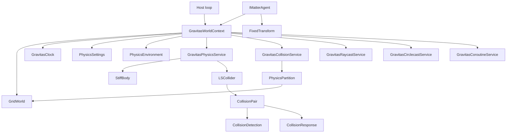

# Gravitas Overview

Gravitas is a deterministic, engine-agnostic physics prototype for lockstep
simulations. It is built on fixed-point math, explicit GridForge worlds, and
context-owned runtime services. The important post-refactor rule is simple:
there is no process-wide physics world. A simulation happens inside a
`GravitasWorldContext`, and every body, collider, partition, query, coroutine,
and clock value belongs to that context.

This wiki is written for developers working on or integrating the library. The
public surface should stay lean; most of the useful context is how the internal
systems connect and where the current prototype needs hardening.

## Reading Path

- Start here for the mental model and the system map.
- Read [Host Integration](HOST_INTEGRATION.md) when wiring Gravitas into a game
  loop, server loop, test harness, or simulation runner.
- Read [Runtime Architecture](RUNTIME_ARCHITECTURE.md) when changing context
  ownership, settings, timing, registration, or lifecycle ordering.
- Read [Collision Pipeline](COLLISION_PIPELINE.md) when changing broad-phase
  partitioning, collision pairs, narrow-phase detection, contact data, or
  response behavior.
- Read [Query Services](QUERY_SERVICES.md) when changing raycasts, circlecasts,
  hit ordering, layer filtering, or query allocation behavior.

## Core Mental Model

Gravitas separates the host loop from deterministic physics state.

The host owns:

- the outer lifecycle and command/input ordering.
- any renderer, ECS, engine object, networking, pooling, or editor integration.
- the `GridWorld` when using `GravitasWorldContext.Attach(...)`.
- host objects that implement `IMatterAgent`.

Gravitas owns, per context:

- fixed-step timing through `GravitasClock`.
- world-local settings and environment values.
- dynamic body and collider registration.
- collision partitions and collision-pair state.
- raycast, circlecast, and coroutine buffers.
- ordered lifecycle hooks.

## Main Types

| Type | Role |
| --- | --- |
| `GravitasWorldContext` | Owns one active `GridWorld` plus all context-local runtime services. |
| `IMatterAgent` | Host boundary. Supplies context, fixed transform, hierarchy state, and interaction state. |
| `StiffBody` | Simulated body state: position, rotation, velocity, acceleration, mass, grounding, impulses, interpolation, and Chronicler record data. |
| `LSCollider` | Base collider state: shape, bounds, layer, trigger/contact events, partition coordinates, pair references, and context binding. |
| `GravitasPhysicsService` | Body/collider registration, context-local collider IDs, collision-pair pooling, simulation phases, and visualization phases. |
| `GravitasCollisionService` | GridForge-backed broad-phase partitioning, active partition tracking, partition pooling, and collision distribution versioning. |
| `PhysicsPartition` | Voxel partition payload containing collider IDs and distributing candidate pairs. |
| `CollisionPair` | Pair identity, culling state, contact state, narrow-phase dispatch, response dispatch, and contact notification state. |
| `CollisionDetection` | Shape-pair narrow-phase collision checks and contact generation. |
| `CollisionResponse` | Prototype position correction and impulse response for colliding bodies. |
| `GravitasRaycastService` | Context-local raycast buffers, candidate gathering, duplicate suppression, and hit ordering. |
| `GravitasCirclecastService` | Context-local circular proximity query buffers and hit ordering. |
| `GravitasCoroutineService` | Lockstep coroutine execution and context-bound wait instructions. |

## Typical Flow

1. The host creates or attaches a `GravitasWorldContext`.
2. The host configures the underlying `GridWorld` with GridForge grids covering
   the simulation space.
3. Host objects expose `IMatterAgent.Context` and `IMatterAgent.Transform`.
4. Dynamic objects create a collider and a `StiffBody`, then call
   `StiffBody.Initialize(...)`.
5. Body initialization registers the body with `GravitasPhysicsService`,
   registers the collider, calculates runtime shape data, and partitions the
   collider into GridForge voxels.
6. Each fixed frame, the host calls `context.Simulate()` and
   `context.LateSimulate()`.
7. Each render or presentation frame, the host calls `context.Visualize()` and
   `context.LateVisualize()`.
8. On pooling, despawn, session reset, or shutdown, the host deactivates objects
   and disposes or resets the context.

## Collision In One Breath

Colliders calculate bounds and are mapped into GridForge voxels by
`GravitasCollisionService`. Each occupied voxel can hold a `PhysicsPartition`.
Partitions store context-local collider IDs and are active when they contain
dynamic objects. During `Simulate`, active partitions distribute candidate
pairs. `GravitasPhysicsService` filters candidates by context, active state,
shape, layer matrix, dynamic/static rules, and sibling relationships. A
`CollisionPair` then performs fast distance/AABB culling before dispatching to
`CollisionDetection`. If the narrow phase finds a contact, it writes a
`ContactPoint`; if the pair has bodies that should receive physics,
`CollisionResponse` applies prototype position correction and impulses. Contact
events are emitted from the active-pair queue during `LateSimulate`.

## Current Prototype Edges

- The library is currently 3D-focused. First-class 2D and mixed 2D/3D
  interactions are design goals, not current guarantees.
- `StiffBody` has a split 2D ground position plus height, but that is not a
  complete 2D physics model.
- Cylinder collider behavior is not implemented.
- Mesh raycast overlap is currently disabled.
- Collision response is a prototype and should be treated as an alpha-hardening
  target, especially around contact manifolds, position correction, angular
  response, triggers, restitution, and physically coherent units.
- Query services use context-owned mutable buffers. Treat them as same-thread,
  fixed-loop services unless they are redesigned for reentrancy.

## Where To Start In Source

| Area | Files |
| --- | --- |
| Context and lifecycle | [`GravitasWorldContext.cs`](../../src/Gravitas/Runtime/GravitasWorldContext.cs), [`GravitasClock.cs`](../../src/Gravitas/Runtime/GravitasClock.cs), [`GravitasLifecycleHooks.cs`](../../src/Gravitas/Runtime/GravitasLifecycleHooks.cs) |
| Host boundary and bodies | [`IMatterAgent.cs`](../../src/Gravitas/Core/IMatterAgent.cs), [`StiffBody.cs`](../../src/Gravitas/Core/StiffBody.cs) |
| Physics service | [`GravitasPhysicsService.cs`](../../src/Gravitas/Core/GravitasPhysicsService.cs) |
| Collision broad phase | [`GravitasCollisionService.cs`](../../src/Gravitas/Core/GravitasCollisionService.cs), [`PhysicsPartition.cs`](../../src/Gravitas/Partitions/PhysicsPartition.cs) |
| Colliders | [`LSCollider.cs`](../../src/Gravitas/Colliders/LSCollider.cs), [`Primitives`](../../src/Gravitas/Colliders/Primitives) |
| Collision handling | [`CollisionPair.cs`](../../src/Gravitas/CollisionHandling/CollisionPair.cs), [`CollisionDetection.cs`](../../src/Gravitas/CollisionHandling/CollisionDetection.cs), [`CollisionResponse.cs`](../../src/Gravitas/CollisionHandling/CollisionResponse.cs) |
| Queries | [`GravitasRaycastService.cs`](../../src/Gravitas/Raycasting/GravitasRaycastService.cs), [`GravitasCirclecastService.cs`](../../src/Gravitas/Raycasting/GravitasCirclecastService.cs), [`RaycastAxisWorker.cs`](../../src/Gravitas/Raycasting/RaycastAxisWorker.cs) |
| Tests and examples | [`tests/Gravitas.Tests`](../../tests/Gravitas.Tests), [`tests/Gravitas.Benchmarks`](../../tests/Gravitas.Benchmarks) |
