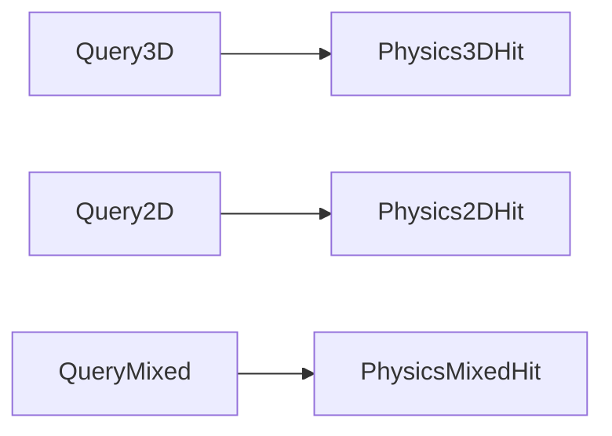

# Query Services

Queries are explicit context-owned services:

- `GravitasWorldContext.Query3D`
- `GravitasWorldContext.Query2D`
- `GravitasWorldContext.QueryMixed`

The services share the collision broad-phase data structures but keep query
truth separate from physical pair filtering. This page is the readable API
guide. For the full query matrix, reducer policies, and per-family notes, read
[Query Reference](QUERY_REFERENCE.md).

## Quick Read

- `Query3D` reports only 3D colliders.
- `Query2D` reports only 2D colliders in the X/Z plane.
- `QueryMixed` reports explicit cross-dimensional sweep hits.
- All-hit APIs write into caller-owned `SwiftList<T>` buffers.
- Batch APIs use typed request spans and caller-owned output/range buffers.
- Public query `PhysicsLayerMask` values are include masks.
- Public query services do not apply collider-local physical ignore masks.
- Query services are same-thread and non-reentrant per context service.



## Public Surface

### 3D Queries

| Family | Closest hit | All hits |
| --- | --- | --- |
| Raycast | `Query3D.Raycast(...)` | `Query3D.RaycastAll(...)` |
| Swept sphere | `Query3D.SweepSphere(...)` | `Query3D.SweepSphereAll(...)` |
| Registered convex source sweeps | `SweepCapsule`, `SweepCuboid`, `SweepCylinder`, `SweepCone`, `SweepConvexMesh`, `SweepCompound` | matching `*All` overloads |
| Cone volume | `Query3D.OverlapCone(...)` | `Query3D.OverlapConeAll(...)` |
| X/Z circle proximity | `OverlapCircle`, `OverlapCircleInDirection` | `OverlapCircleAll` |

### 2D Queries

| Family | Closest hit | All hits |
| --- | --- | --- |
| Circle overlap | `Query2D.OverlapCircle(...)` | `Query2D.OverlapCircleAll(...)` |
| AABB overlap | `Query2D.OverlapAabb(...)` | `Query2D.OverlapAabbAll(...)` |
| Convex polygon overlap | `Query2D.OverlapPolygon(...)` | `Query2D.OverlapPolygonAll(...)` |
| Segment raycast | `Query2D.Raycast(...)` | `Query2D.RaycastAll(...)` |
| Swept circle | `Query2D.SweepCircle(...)` | `Query2D.SweepCircleAll(...)` |

### Mixed Queries

| Family | Closest hit | All hits |
| --- | --- | --- |
| 3D sphere against embedded 2D slabs | `QueryMixed.SweepSphereAgainst2D(...)` | `QueryMixed.SweepSphereAgainst2DAll(...)` |
| 2D circle slab against 3D colliders | `QueryMixed.SweepCircleAgainst3D(...)` | `QueryMixed.SweepCircleAgainst3DAll(...)` |

`Query2D` and `Query3D` stay dimension-local and never report
cross-dimensional hits. Mixed queries are always explicit.

## Common Usage

```csharp
using Gravitas.Queries;
using Gravitas.Support;
using SwiftCollections;

PhysicsLayerMask mask = PhysicsLayerMask.FromLayer(0);

bool hit = context.Query3D.Raycast(
    origin,
    direction,
    maxDistance,
    out Physics3DHit rayHit,
    mask);

SwiftList<Physics2DHit> hits2D = new();
int hitCount2D = context.Query2D.RaycastAll(
    start2D,
    end2D,
    mask,
    hits2D);

SwiftList<PhysicsMixedHit> mixedHits = new();
int mixedHitCount = context.QueryMixed.SweepSphereAgainst2DAll(
    origin,
    origin + direction * maxDistance,
    radius,
    mask,
    mixedHits,
    excludedCollider: null);
```

All-hit methods clear the caller-provided list, write sorted hits, and return
the hit count.

## Batch Pattern

High-volume lockstep systems should prefer batch APIs when issuing many related
queries in one frame.

```csharp
PhysicsRaycast3DRequest[] requests = new PhysicsRaycast3DRequest[agentCount];
Physics3DHit[] closestHits = new Physics3DHit[agentCount];
SwiftList<Physics3DHit> allHits = new(agentCount * 4);
PhysicsQueryHitRange[] ranges = new PhysicsQueryHitRange[agentCount];

for (int i = 0; i < agentCount; i++)
{
    requests[i] = new PhysicsRaycast3DRequest(
        sensorOrigins[i],
        sensorTargets[i],
        mask);
}

int closestHitCount = context.Query3D.RaycastBatch(requests, closestHits);
int allHitCount = context.Query3D.RaycastAllBatch(requests, allHits, ranges);

for (int requestIndex = 0; requestIndex < agentCount; requestIndex++)
{
    PhysicsQueryHitRange range = ranges[requestIndex];
    for (int hitIndex = 0; hitIndex < range.Count; hitIndex++)
    {
        Physics3DHit queryHit = allHits[range.Start + hitIndex];
        // Consume this request's sorted hits.
    }
}
```

Request order is preserved in closest-hit output and all-hit ranges. Hits inside
each request keep the same deterministic ordering as the matching single-query
API.

## Layer Mask Semantics

Queries accept `PhysicsLayerMask layerMask` as an include mask:

- `PhysicsLayerMask.FromLayer(layer)` includes one layer.
- `PhysicsLayerMask.FromLayers(...)` includes several layers.
- `PhysicsLayerMask.All` includes every layer.
- `PhysicsLayerMask.None` includes no layers.

Use `PhysicsLayer` for a collider's single collision/filter layer and
`PhysicsLayerMask` for query or ground-check filters.

Public query services do not apply `LSCollider.IgnoredCollisionLayers` or
`LSCollider2D.IgnoredCollisionLayers`. Those masks are physical
collider-to-collider filters for collision pairs, CCD, and grounding/support.
Queries report whatever the caller's include mask, trigger flag, and explicit
excluded-collider arguments select.

## Hit Data

| Hit type | Used by | Key fields |
| --- | --- | --- |
| `Physics3DHit` | `Query3D` | `Collider`, `Body`, `Point`, `Normal`, `Distance`, `Direction` |
| `Physics2DHit` | `Query2D` | `Collider`, `Body`, `Point`, `Normal`, `Distance` |
| `PhysicsMixedHit` | `QueryMixed` | `Collider3D`, `Collider2D`, `Body3D`, `Body2D`, `Point3D`, `Point2D`, `Normal3DTo2D`, source-oriented normals, `ReducerKind`, `Distance`, `Direction3D` |

Static/bodyless hits can have a collider with a null body.

`PhysicsMixedHit.Normal3DTo2D` follows the mixed contact invariant: it points
from the 3D side toward the embedded 2D volume. Source-oriented normals are
provided so CCD helpers do not need to reinterpret that invariant.

## Reentrancy

Query services keep mutable buffers on the service instance. Do not run
multiple queries concurrently against the same context service. The design
matches a single-threaded deterministic lockstep loop.

Hosts that need parallel query workloads should use separate contexts or add an
explicit caller-owned query job/state design with tests and benchmarks.

## Rules That Matter

- Keep 2D, 3D, and mixed query services explicit.
- Keep all-hit buffers caller-owned.
- Preserve deterministic hit ordering.
- Use query include masks, not physical ignore masks, for public query
  filtering.
- Keep mesh-source boundaries explicit.
- Treat `ReducerKind` as part of mixed query truth.
- Add benchmarks when query candidate gathering, reducer math, batching, or hit
  ordering changes.

## Source Map

| Area | Source |
| --- | --- |
| 3D queries | [`src/Gravitas/Queries/3D`](../../src/Gravitas/Queries/3D) |
| 2D queries | [`src/Gravitas/Queries/2D`](../../src/Gravitas/Queries/2D) |
| Mixed queries | [`src/Gravitas/Queries/Mixed`](../../src/Gravitas/Queries/Mixed) |
| Common hit ranges | [`src/Gravitas/Queries/Common/PhysicsQueryHitRange.cs`](../../src/Gravitas/Queries/Common/PhysicsQueryHitRange.cs) |
| Query tests | [`tests/Gravitas.Tests/Queries`](../../tests/Gravitas.Tests/Queries), [`tests/Gravitas.Tests/Physics2D`](../../tests/Gravitas.Tests/Physics2D), [`tests/Gravitas.Tests/MixedDimensions`](../../tests/Gravitas.Tests/MixedDimensions) |
| Query benchmarks | [`tests/Gravitas.Benchmarks/Queries`](../../tests/Gravitas.Benchmarks/Queries) |
