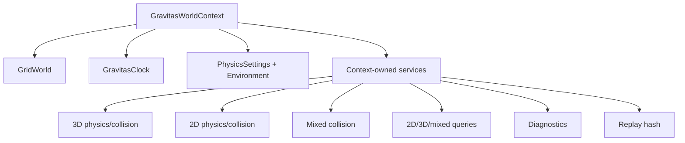

# Runtime Architecture

Gravitas is context-first. `GravitasWorldContext` is the host-facing object that
ties together one explicit `GridWorld`, deterministic clock state, settings,
physical environment values, and the mutable services needed to run one
simulation.

For host wiring, read [Host Integration](HOST_INTEGRATION.md). For dimensional
mode choices, read [2D, 3D, And Runtime Modes](DIMENSIONS.md).

## Quick Read

- One live `GridWorld` can be attached to at most one live
  `GravitasWorldContext`.
- Runtime state is context-local: bodies, collider IDs, partitions, pairs,
  queries, diagnostics, coroutines, constraints, and replay hash state.
- `Simulate()` advances clock/service front-half work; `LateSimulate()`
  integrates bodies, refreshes partitions, solves contacts/joints, processes
  CCD, and updates sleep/grounding.
- `Visualize()` publishes presentation state; it is not authoritative.
- `PhysicsRuntimeMode.Both` runs 2D and 3D side by side. `Mixed` adds the
  dedicated cross-dimensional lifecycle.
- Chronicler populates host-created runtime shells; it does not construct the
  runtime object graph.



## Context Ownership

`GravitasWorldContext` can be created in two ways:

- `CreateOwned(...)` creates a new `GridWorld` and disposes it with the context.
- `Attach(world, takeOwnership: false)` binds to a host-created active
  `GridWorld`.

Internally, contexts use a strong, process-wide ownership registry to prevent
one active `GridWorld` from being attached to multiple live contexts. World
activity validation, registration, and disposal are serialized under the same
lock. An owned world's entry remains registered until `GridWorld.Dispose()`
finishes; a host-owned world's entry is released without disposing the world.
Hosts must explicitly dispose every context to release its registry entry.
This registry is process-wide metadata, not simulation state.

## Service Map

Most host code should interact with the context and domain objects. Mutable
implementation details stay inside services.

| Service | Primary responsibility |
| --- | --- |
| `GravitasPhysicsService` | 3D body/collider registration, 3D CCD, 3D pairs, 3D response islands, sleep. |
| `GravitasConstraint3DService` | Context-local 3D joints, ragdolls, linked-collider filtering, metrics, replay hashing. |
| `GravitasPhysics2DService` | 2D body/collider registration, 2D CCD, 2D pairs, response islands, grounding, visualization. |
| `GravitasConstraint2DService` | Context-local 2D joints, ragdolls, linked-collider filtering, metrics, replay hashing. |
| `GravitasMixedCollisionService` | Dedicated mixed 2D/3D broad phase, pair lifecycle, constrained response, partition cleanup. |
| `GravitasCollisionService` | GridForge-backed 3D partitions, duplicate suppression, culling, retained partition cleanup. |
| `GravitasCollision2DService` | GridForge-backed 2D partitions, awake dynamic membership, retained partition cleanup. |
| `GravitasQuery3DService` | 3D raycasts, swept-sphere and convex-source sweeps, cone volumes, X/Z circle proximity. |
| `GravitasQuery2DService` | 2D overlaps, segment raycasts, swept-circle queries, hit ordering. |
| `GravitasQueryMixedService` | Explicit mixed sphere-against-2D and circle-against-3D sweeps. |
| `GravitasCoroutineService` | Lockstep coroutines and context-bound waits. |
| `GravitasDiagnosticSink` | Disabled-by-default event and debug draw buffers. |
| `GravitasLifecycleHooks` | Ordered simulate, late-simulate, visualize, late-visualize, reset, and frame-rate callbacks. |
| `GravitasReplayHashService` | Fixed-order replay hash contributor over authoritative context/runtime state. |

## Frame Phases

Context methods run in this order:

```text
Simulate
  Clock.Simulate
  3D Physics.Simulate when enabled
  2D Physics2D.Simulate when enabled
  MixedCollisions.Simulate in Mixed mode
  Coroutines.Simulate
  Hooks.InvokeSimulate

LateSimulate
  Clock.LateSimulate
  Prepare CCD frame state
  Integrate enabled 3D and 2D bodies
  Process same-service CCD handoffs
  Refresh dynamic collider partitions
  Distribute collision candidates
  Solve deterministic contact and joint islands
  Refresh grounding/support
  Retire retained partitions
  Update sleep state
  Process cross-service CCD handoffs
  Run mixed contacts and constrained response in Mixed mode
  Hooks.InvokeLateSimulate

Visualize
  Clock.Visualize
  Publish enabled 3D and 2D presentation transforms
  MixedCollisions.Visualize in Mixed mode
  Hooks.InvokeVisualize

LateVisualize
  Hooks.InvokeLateVisualize
```

This order is a runtime contract, not just an implementation detail. Ordered
host commands should be applied before `Simulate()`. Transform teleports made
before `Simulate()` are reflected in the same fixed step because dynamic-body
colliders refresh before collisions are distributed in `LateSimulate()`. Force
and acceleration commands made before `Simulate()` are integrated during
`LateSimulate()` and included in that same post-integration collision pass.

Lifecycle hooks run after built-in work for their phase. `Visualize()` is the
built-in presentation phase used by bodies and services. `LateVisualize()` is
hook-only until a real presentation invariant needs that phase.

## Clock State

`GravitasClock` stores:

- `FrameRate`
- `DeltaTime`
- `InvDeltaTime`
- `FrameCount`
- `TotalTime`
- `AccumulatedTime`
- `ExpectedAccumulation`
- `ResetAccumulation`
- `ResetAccumulationThisVisualize`

Simulation code should use context time values rather than wall-clock APIs.
`Visualize()` advances deterministic accumulation by the fixed delta, not by
elapsed real time. `ExpectedAccumulation` is clamped to one simulation frame so
visual interpolation cannot overshoot its target.

## Registration Model

Dynamic 3D bodies are stored in a `SwiftBucket<SolidBody>`. Their `DynamicId` is
the bucket index returned by `GravitasPhysicsService.AssimilateBody(...)`.

3D and 2D colliders use a shared context-local registry shape: reusable
`SwiftBucket` slots provide stable live IDs, while compact live lists provide
cache-friendly service iteration. Collider ID `0` is valid; `-1` is the
unregistered sentinel. Removing a collider releases its slot for reuse and
compacts service iteration. Because IDs are context-local, two different
contexts can both have collider ID `0`. Lookups must go through the owning
context's physics service. Replay hashing does not treat reusable bucket IDs as
authoritative snapshot identity: each hash pass builds canonical live
registration order and writes dense replay ordinals for collider, hierarchy,
and pair identity.

Both 3D and 2D physics services keep compact service-refresh lists for bodyless
and non-dynamic colliders. Dynamic body buckets refresh dynamic-body colliders,
so fixed-step partition preparation only visits colliders whose bounds can
change through that ownership path.

3D joints use context-local IDs allocated by `GravitasConstraint3DService`.
Removing a joint releases solver cache and linked-collider suppression state,
but does not reuse that joint ID in the same context. 2D joints follow the
same context-local ownership principle through `GravitasConstraint2DService`.

`SolidBody(agent, collider)` requires the agent and collider to belong to the
same context. `CollisionPair.Initialize(...)` rejects colliders from different
contexts. These checks are core invariants.

## Body State

### `SolidBody`

`SolidBody` is the 3D body model. It owns:

- position, exposed as `Position3d`.
- rotation and derived basis vectors.
- visual interpolation buffers.
- linear/angular velocity, acceleration, impulses, drag, friction, and
  restitution inputs.
- per-body gravity scale.
- body-local and world-space center of mass.
- mass, inverse mass, inertia tensor, and solver-effective values.
- current and previous-step grounding state.
- deterministic sleep state.
- Chronicler record data.

Body movement happens in `SolidBody.LateSimulate()`, called by
`GravitasPhysicsService.LateSimulate()`. Non-kinematic movable bodies process
forces, update velocities, commit position/rotation changes, run their selected
ground probe, and then the service refreshes dynamic collider partitions before
3D pair distribution.

Kinematic bodies read their host transforms during `LateSimulate()`. When CCD is
enabled, the body records its frame-start pose, treats the host transform as the
requested target pose, and sweeps between those poses as an active source.

### `SolidBody2D`

`SolidBody2D` is the 2D body model. It owns:

- X/Z-projected `Vector2d` position.
- scalar rotation/yaw.
- planar velocity and force integration.
- scalar angular velocity/acceleration.
- 2D gravity and gravity scale.
- body-local/world center of mass.
- scalar moment of inertia and solver-effective values.
- planar grounding/support state.
- deterministic sleep state.
- Chronicler record data.

It intentionally has no `HeightPos`, y-up step offset, visual interpolation
state, or 3D inertia tensor. `GravitasPhysics2DService.Visualize()` publishes
dynamic 2D position and yaw rotation back to the host transform while preserving
the host's vertical height.

## Collider State

`LSCollider` owns the host-facing 3D collider surface:

- context binding and context-local ID.
- optional `SolidBody` binding or host-only `IMatterAgent`.
- active/trigger state.
- layer and local physical filtering.
- shape type, shape priority, shape dimensions, material, bounds, and runtime
  shape versioning.
- partition coordinates and broad-phase versioning.
- query stamps.
- explicit hierarchy metadata.
- collision-pair references.
- contact and trigger events.

Dense mutable groups inside `LSCollider` are split into internal state helpers:
runtime shape, partition, query, hierarchy, and pair state. 2D colliders use
the same helper pattern through `LSCollider2D`, with dimensional payloads kept
2D-specific.

Dynamic colliders update through their bodies during simulation phases.
Bodyless 3D and 2D colliders are refreshed from their agent transforms during
fixed-step partition preparation, so host-authored transform changes are visible
on the next step. Hosts can still call `collider.Simulate()` when they need an
immediate bounds and partition refresh before issuing same-frame queries.

## Serialization And Replay State

Chronicler follows the stack-wide populate-existing-shell contract. The host
creates the context, world, agents, transforms, body instances, and concrete
collider shape types before loading. Chronicler transfers authoritative
simulation values into those objects.

Host bindings, context-local service IDs, partition lists, pair tables, query
buffers, diagnostic buffers, delegates, and visual interpolation state are not
snapshot identity.

Replay hashing follows the same boundary: body/collider values are
authoritative when they affect deterministic continuation. Runtime collider IDs
remain context-local lookup and pair keys, while replay hashing uses canonical
live registration order with dense replay ordinals. Deleted ID history,
free-list ordering, and allocator holes are not authoritative replay identity.
Retained pair/contact state and active CCD handoffs are hashed by the context
services that own their ordering.

Read [Serialization And Replay](SERIALIZATION.md) before changing serialized
fields, load defaults, or replay tests.

## Settings And Environment

`PhysicsSettings` holds frame rate, runtime mode, collision matrix, pooling
switch, ground-check layer mask, default continuous-collision mode, retained
partition cleanup settings, solver settings, restitution cutoff, and mixed 2D
half-thickness. The collision matrix uses `true` for collide and `false` for
ignore.

`PhysicsEnvironment` holds physical and culling values such as gravity, air
density, speed caps, friction transition speed, damping, and culling scores.
Environment values are mutable per context.

`SolidBody` drag is a deterministic integration model, not a full aerodynamic
solver. The linear drag path uses body drag coefficient, air density, collider
frontal area, and current speed to accumulate acceleration opposite motion. A
quadratic drag model would be a deliberate physics change with tests,
benchmarks, and clear units.

## Coroutines And Hooks

`GravitasCoroutineService` runs lockstep coroutines during
`context.Simulate()`. Supported wait instructions are context-bound:

- `WaitForFrames`
- `WaitForNextSimulate`
- `WaitForRealSeconds`

They use the context clock, so coroutine behavior stays frame-deterministic and
multi-context safe.

Lifecycle hooks are internal context registrations. Each hook has an owner name
and order. Hooks are sorted by order, then owner name. Invocation snapshots the
hook list before callbacks run, keeping iteration stable if a callback
registers or unregisters another hook.

## Runtime Invariants

- A live `GridWorld` has at most one live `GravitasWorldContext`.
- Every collider belongs to one context for its active lifetime.
- Collision pairs cannot cross context boundaries.
- 2D bodies and colliders are simulated by `GravitasPhysics2DService`.
- 2D/3D contacts are produced only by `GravitasMixedCollisionService` when
  `PhysicsRuntimeMode.Mixed` is active.
- 2D joints and ragdolls link `SolidBody2D` instances through planar
  anchors and scalar angles, not projected 3D frames.
- Partition ownership is through the corresponding collision service.
- Query services resolve collider IDs through their owning context only.
- Diagnostic events and draw commands describe one context only.
- Simulation state changes belong in fixed-step phases, not visualization
  phases.

## Source Map

| Area | Source |
| --- | --- |
| Context | [`src/Gravitas/Runtime/GravitasWorldContext.cs`](../../src/Gravitas/Runtime/GravitasWorldContext.cs) |
| Clock | [`src/Gravitas/Runtime/GravitasClock.cs`](../../src/Gravitas/Runtime/GravitasClock.cs) |
| Lifecycle hooks | [`src/Gravitas/Runtime/GravitasLifecycleHooks.cs`](../../src/Gravitas/Runtime/GravitasLifecycleHooks.cs) |
| 3D body/service | [`src/Gravitas/Core/3D`](../../src/Gravitas/Core/3D) |
| 2D body/service | [`src/Gravitas/Core/2D`](../../src/Gravitas/Core/2D) |
| Mixed service | [`src/Gravitas/Core/Mixed`](../../src/Gravitas/Core/Mixed) |
| Colliders | [`src/Gravitas/Colliders`](../../src/Gravitas/Colliders) |
| Partitions | [`src/Gravitas/Partitions`](../../src/Gravitas/Partitions) |
| Queries | [`src/Gravitas/Queries`](../../src/Gravitas/Queries) |
| Diagnostics | [`src/Gravitas/Diagnostics`](../../src/Gravitas/Diagnostics) |
| Replay hashing | [`src/Gravitas/Determinism`](../../src/Gravitas/Determinism) |
