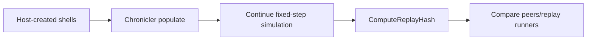

# Serialization And Replay

Gravitas uses Chronicler for deterministic state transfer into host-created
runtime shells. The goal is not to materialize a full engine object graph from
data. The host creates the context, world, agents, transforms, body instances,
and concrete collider shape types; Chronicler populates deterministic physics
state into those existing objects.

This contract supports lockstep debugging, rollback-style validation, save-state
testing, and replay tools.

## Quick Read

- Serialize authoritative simulation state, not host object identity.
- Load into existing runtime shells created by the host.
- Rebuild context-owned runtime caches after load.
- Populate settings before body/collider state when snapshots include
  `PhysicsSettingsSaver`.
- Use `GravitasWorldContext.ComputeReplayHash()` for compact conformance checks.
- Treat hash strings as deterministic non-cryptographic signals, not
  cross-version compatibility values.
- Keep `ReleaseLean` compiling when serialization-related fields or attributes
  change.

## Ownership Contract

| Host-created shell                                 | Serialized state                                                                                                                                              |
| -------------------------------------------------- | ------------------------------------------------------------------------------------------------------------------------------------------------------------- |
| `GravitasWorldContext` and `GridWorld`             | Settings that affect deterministic execution.                                                                                                                 |
| `IMatterAgent`, `FixedTransform`, engine wrappers  | Body position, rotation, velocities, force/torque stores, gravity scale, sleep, CCD, freeze axes.                                                             |
| `SolidBody`, `SolidBody2D`                         | 3D grounding state and 2D planar support state.                                                                                                               |
| Concrete `LSCollider` and `LSCollider2D` types     | Active/trigger state for bodyless trigger volumes, layer, local ignored physical layers, material, local offset, shape inputs, mixed half-thickness override. |
| Compound runtime shells and private part colliders | Authored shape/part values needed to rebuild deterministic geometry.                                                                                          |
| Existing registered `Joint3D`, `Joint2D`, ragdoll runtimes | Joint enabled state, type, frames, limits, motors, linked collision policy, ragdoll activation state.                                              |
| Renderer, ECS, networking, pooling, editor state   | Nothing. These remain host-owned.                                                                                                                             |

Runtime-owned state that should not be serialized:

- context-local collider IDs and service indices.
- GridForge partition coordinate lists and active partition payloads.
- collision pairs, pair holder references, warm runtime pair caches, query
  buffers, diagnostic buffers, and pooled collections.
- context-local joint IDs, ragdoll IDs, articulation suppression tables, and
  service-owned joint/ragdoll arrays.
- lifecycle hooks, delegates, renderer callbacks, and event subscribers.
- host transform object identity.
- 3D visual interpolation buffers and presentation-only rotation speed state.

On load, bodies publish restored authoritative position and rotation into their
existing host transform. A restored 3D quaternion is scale-safely normalized
before any runtime shape or host state observes it; a zero quaternion resolves
to identity. 3D visual interpolation buffers reset from that authoritative
state instead of being treated as replay truth.

## Recordable Types

| Type                                    | What it records                                                                                                                                                                            | What it does not own                                             |
| --------------------------------------- | ------------------------------------------------------------------------------------------------------------------------------------------------------------------------------------------ | ---------------------------------------------------------------- |
| `SolidBody`                             | 3D position/height, rotation, freeze axes, motion stores, mass, COM, gravity scale, sleep, CCD, grounding/probe state, owned collider state.                                               | `FixedTransform` identity, service IDs, partitions, pairs.       |
| `SolidBody2D`                           | X/Z position, scalar rotation, freeze axes, planar motion stores, scalar angular state, mass, COM, scalar moment policy, gravity, grounding/probe state, sleep, CCD, owned collider state. | Host transform identity, runtime service IDs, query buffers.     |
| `LSCollider`                            | 3D active state, bodyless trigger state, layer/filter state, local ignored physical mask, material, shape state.                                                                           | Context-owned collider ID, partition identity, pairs/events.     |
| `LSCollider2D`                          | 2D active state, bodyless trigger state, layer/filter state, material, shape-local values, mixed half-thickness override.                                                                  | Context-owned collider ID, private runtime pair/partition state. |
| `ColliderShapeDefinition`               | Data-only 3D authoring/import values for primitive, mesh, and compound part inputs.                                                                                                        | Runtime body, context, collider ID, pairs, hierarchy, events.    |
| `ColliderShapeDefinition2D`             | Data-only 2D authoring/import values for circle, capsule, AABB, convex polygon, triangle convenience, and compound parts.                                                                  | Runtime body, context, collider ID, pairs, hierarchy, events.    |
| `PhysicsSettingsSaver`                  | Frame rate, collision matrix, ground mask, CCD settings, restitution threshold, retained partition cleanup, runtime mode, mixed 2D thickness.                                              | Runtime service state.                                           |
| `Joint3D` / `Joint2D`                   | Mutable joint continuation state: enabled flag, type, frames/anchors, limits, motors, linked-collider policy.                                                                              | Body link construction, service joint IDs, solver caches.        |
| `RagdollRuntime3D` / `RagdollRuntime2D` | Runtime activation state for existing handles.                                                                                                                                             | Definitions, link bodies, colliders, joint ownership.            |
| `PhysicsLayer` / `PhysicsLayerMask`     | JSON/MemoryPack-friendly value fields.                                                                                                                                                     | Chronicler graph identity.                                       |

Collider geometry can derive default COM/mass properties for new shells, but
populated snapshots restore body-owned COM state directly where that state is
authoritative.

Pair-local contact caches and joint solver caches are rebuildable runtime data
unless a drift investigation explicitly hashes them through
`GravitasReplayHashMode.AuthoritativeWithSolverCaches`.

Joint and ragdoll handles are valid serialization targets only while registered
with their owning constraint service. Endpoint teardown removes dependent
joints and any owning ragdoll before collider identity release; removed handles
reject save and load operations instead of applying state to a later pooled body
or collider lifetime. Context reset and disposal invalidate those handles by the
same rule.

## Replay Workflow

A deterministic replay or rollback restore should follow this shape:

1. Create or attach a `GravitasWorldContext` with matching settings and
   GridForge world setup.
2. Create host agents, transforms, bodies, and concrete collider shapes in the
   same stable order the host expects.
3. Materialize authored 3D and 2D compound assets from
   `ColliderShapeDefinition`, `ColliderShapeDefinition2D`, and compound part
   data before binding.
4. Populate settings first when the snapshot includes `PhysicsSettingsSaver`.
5. Populate body/collider/joint/ragdoll state into existing shells.
6. Continue fixed-step simulation from the restored frame using the same ordered
   input commands.

For dynamic replay tests, compare the uninterrupted simulation against a fresh
shell restored at frame N and advanced with the same subsequent inputs. Do not
compare runtime-owned service IDs or partition list identities; compare
authoritative body/collider values and externally observable collision/query
behavior.

## Replay Hashes

`GravitasWorldContext.ComputeReplayHash()` is the preferred compact conformance
signal for replay and rollback tests.

After Chronicler populates existing runtime shells, the restored context should
produce the same per-frame `ChronicleHash` sequence as the uninterrupted context
when both receive the same subsequent inputs.

The authoritative hash follows the same boundary as
`IRecordable.RecordData(...)`:

- serialized continuation state is included.
- host-owned bindings are excluded.
- rebuildable runtime caches are excluded.
- active cross-frame CCD handoff state is included because it can affect the
  next fixed step.
- runtime collider IDs are context-local lookup and pair keys; replay hashes use
  canonical live registration order with dense replay ordinals for collider,
  hierarchy, and pair identity, so deleted collider ID history and allocator
  holes are excluded.
- solver caches and diagnostic counters are included only in
  `AuthoritativeWithSolverCaches` mode for RCA.

Replay hashes use Chronicler's `ChronicleHash` value and hash-writer mechanics.
Gravitas owns the physics-specific inclusion policy and deterministic ordering.

## Transport Notes

Standard `Release` builds include MemoryPack support through the standard
dependency chain. `ReleaseLean` defines `GRAVITAS_DISABLE_MEMORYPACK`, excludes
the direct MemoryPack package, and relies on shim attributes needed for the same
core API to compile without built-in MemoryPack support.

When changing serialized fields, defaults, or load behavior:

- add or update save/populate tests under `tests/Gravitas.Tests/Serialization`.
- cover JSON and MemoryPack in standard builds.
- keep the same source compiling under `ReleaseLean`.
- run focused replay tests that serialize, restore into a fresh shell, and
  continue simulation.
- document whether the field is authoritative simulation state, host-owned
  binding, or runtime cache.

## Rules That Matter

- Do not turn Chronicler loading into a construct-from-data object factory.
- Do not serialize host bindings such as engine objects, renderers, or external
  transform object identity.
- Do not serialize context-local IDs as portable identity.
- Keep JSON and MemoryPack behavior aligned when both are supported.
- Treat presentation-only data and runtime caches as rebuildable.
- Add replay-continuation tests when state affects deterministic continuation.

## Source Map

| Area                            | Source                                                                                                                 |
| ------------------------------- | ---------------------------------------------------------------------------------------------------------------------- |
| 3D body serialization           | [`src/Gravitas/Core/3D/SolidBody.Serialization.cs`](../../src/Gravitas/Core/3D/SolidBody.Serialization.cs)             |
| 2D body serialization           | [`src/Gravitas/Core/2D/SolidBody2D.Serialization.cs`](../../src/Gravitas/Core/2D/SolidBody2D.Serialization.cs)         |
| 3D collider replay/record state | [`src/Gravitas/Colliders/3D/LSCollider.ReplayHash.cs`](../../src/Gravitas/Colliders/3D/LSCollider.ReplayHash.cs)       |
| 2D collider replay/record state | [`src/Gravitas/Colliders/2D/LSCollider2D.ReplayHash.cs`](../../src/Gravitas/Colliders/2D/LSCollider2D.ReplayHash.cs)   |
| Settings saver                  | [`src/Gravitas/Settings/PhysicsSettingsSaver.cs`](../../src/Gravitas/Settings/PhysicsSettingsSaver.cs)                 |
| Replay hash service             | [`src/Gravitas/Determinism/GravitasReplayHashService.cs`](../../src/Gravitas/Determinism/GravitasReplayHashService.cs) |
| Serialization tests             | [`tests/Gravitas.Tests/Serialization`](../../tests/Gravitas.Tests/Serialization)                                       |
| Replay conformance tests        | [`tests/Gravitas.Tests/Determinism`](../../tests/Gravitas.Tests/Determinism)                                           |
